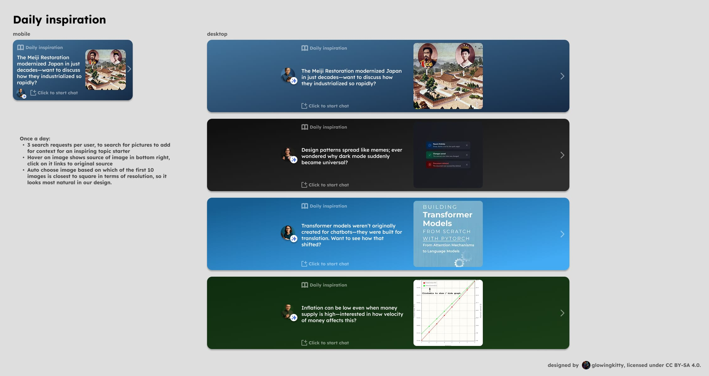

# Daily Inspiration



## Overview
Daily Inspiration is a feature that provides users with three curated, thought-provoking prompts each day designed to spark curiosity, encourage exploration, and inspire learning. These inspirations appear as interactive banners in the new chat screen, allowing users to discover fascinating topics and start meaningful conversations.

## Purpose
Daily Inspiration aims to:
- Encourage curiosity-driven learning and exploration through video content
- Present users with interesting facts, questions, and topics they might not have considered
- Create opportunities for discovery and intellectual growth via educational videos
- Provide engaging conversation starters that inspire deeper engagement and direct learning

## Architecture

### Post-Processing Integration

#### Topic Suggestions Collection
During the post-processing phase of message handling, the system collects topic suggestions that inform daily inspiration generation:

- **Output Field**: `daily_inspiration_topic_suggestions` (array of 3 topic suggestions)
- **Collection Point**: Post-processing LLM call (same stage as follow-up and new chat suggestions)
- **Purpose**: These suggestions capture user interests and conversation topics that can inform personalized daily inspirations

#### Server-Side Caching
Topic suggestions are stored server-side with encryption and time-based expiration:

- **Storage**: Encrypted cache entries per user
- **Expiration**: 24 hours per entry
- **Retention**: Last 50 suggestions per user (rolling window)
- **Update Frequency**: Every time post-processing completes for a user message
- **Encryption**: Server-side encryption ensures privacy of user interests

### Daily Generation Process

#### Generation Triggers
Daily inspirations are generated through two mechanisms:

1. **Immediate Generation (First Paid Request)**
   - **Trigger**: After post-processing completes for a user's first paid request
   - **Purpose**: Provide personalized daily inspirations immediately after account creation, without waiting for the daily scheduled job
   - **Quantity**: Generates 3 new inspirations to replace any default/placeholder inspirations
   - **Model**: Uses the default main processing model (more powerful than post-processing model)
   - **Method**: Function calling to generate structured inspiration data

2. **Scheduled Daily Generation**
   - **Trigger**: Scheduled daily job (executes once per 24-hour period)
   - **Model**: Uses the default main processing model (more powerful than post-processing model)
   - **Method**: Function calling to generate structured inspiration data
   - **Scope**: Generates inspirations for users who made paid requests in the last 24 hours
   - **Processing**: **One LLM call per user** to prevent context mixing between different users' topic suggestions and preferences
   - **Dynamic Quantity**: Generates only as many new inspirations as the user viewed the previous day (1 viewed = 1 new, 3 viewed = 3 new, etc.)

#### Load Distribution
To prevent server overload and ensure scalability, daily inspiration generation is spaced out over time:

- **Distribution Strategy**: Instead of processing all users simultaneously, generation is distributed across a time window
- **Implementation Options**:
  - **Time-based staggering**: Process users in batches based on user ID hash or registration time
  - **Queue-based processing**: Use a job queue with rate limiting to process users gradually
  - **Geographic distribution**: Stagger generation based on user timezone to align with local "daily" cycles
- **Benefits**:
  - Prevents server resource spikes
  - More predictable load patterns
  - Better scalability as user base grows
  - Reduced risk of rate limiting from LLM providers
- **Considerations**:
  - Users may receive their daily inspirations at slightly different times
  - Generation window should complete within a reasonable timeframe (e.g., within 2-4 hours)
  - Failed generations can be retried without affecting the entire batch

#### Activity Criteria
New daily inspirations are only generated for users who:
- Made at least one **paid request** to the server within the last 24 hours (tracked via Unix timestamp)
- This ensures costs are only incurred for users who are actively using the platform and participate in covering costs

**View Tracking**:
- The server tracks which daily inspiration IDs have been viewed by each user
- Only inspiration IDs are stored (inspirations themselves are stored client-side encrypted, just like messages)
- This tracking enables the system to generate only as many new inspirations as were actually viewed

**Cost Optimization**:
- If a user viewed 0 inspirations: No new inspirations generated (saves costs)
- If a user viewed 1 inspiration: 1 new inspiration generated
- If a user viewed 2 inspirations: 2 new inspirations generated
- If a user viewed 3 inspirations: 3 new inspirations generated
- This ensures costs scale with actual user engagement

If a user hasn't made a paid request in the last 24 hours, their existing daily inspirations are preserved (since they haven't seen them yet or aren't actively using the platform).

#### Generation Function Call Structure
Each daily inspiration contains:

1. **Phrase/Fact**: A thought-provoking phrase or fascinating fact that encourages exploration
   - Example: "The Meiji Restoration modernized Japan in just decades—want to discuss how they industrialized so rapidly?"
   - Designed to spark curiosity and invite conversation

2. **Video Search Query**: A search query string used to find relevant educational videos
   - Used with Brave search API to locate relevant videos
   - Should be descriptive enough to find appropriate video content that encourages learning about the topic

3. **Chat Title**: The title that will be used when the user starts a chat from this inspiration
   - Generated by the LLM (similar to how preprocessor generates chat titles)
   - Should be concise and descriptive

4. **Category/Mate**: The mate (category) that best fits this inspiration
   - Used to determine the background color of the inspiration banner
   - Helps users understand the type of conversation they'll have

### Delivery and Caching

#### Real-Time Delivery (WebSocket)
When daily inspirations are generated, the system attempts immediate delivery:

- **Logged-In Users**: Daily inspirations are delivered immediately via WebSocket to all active connections for that user
  - Uses the existing WebSocket infrastructure (`ConnectionManager`)
  - Delivered to all browser instances/devices where the user is currently logged in
  - Client receives encrypted inspiration data and stores it locally (same encryption as messages)
  - No server-side storage required for logged-in users

- **Offline Users**: If the user is not currently logged in, generated inspirations are temporarily cached server-side
  - **Storage**: Server-side cache only (not Directus, following privacy policy)
  - **Encryption**: Server-side encryption using user's vault key (`encrypt_with_user_key`)
  - **Expiration**: 7 days from generation time
  - **Purpose**: Allow users who log in within a week to receive their generated inspirations
  - **Note**: Server can decrypt cached inspirations using vault key (needed for delivery), but they are never stored in Directus

#### Cache Expiration Policy
- **Cache Duration**: 7 days from generation timestamp
- **Rationale**:
  - Balances user experience (users may not log in daily) with data retention policies
  - After 7 days, inspirations are considered stale and no longer relevant
  - Prevents indefinite storage of unused data
  - Aligns with privacy best practices (minimal data retention)
- **Expiration Behavior**: 
  - If user logs in within 7 days: Cached inspirations are delivered via WebSocket, then removed from cache
  - If user doesn't log in within 7 days: Cached inspirations are automatically dropped (no delivery)
  - Expired cache entries are cleaned up automatically by the cache service

#### Delivery Flow
1. **Generation Completes** → Check if user has active WebSocket connections
2. **If Connected**: 
   - Encrypt inspirations with user's vault key (server-side encryption)
   - Send encrypted inspirations immediately via WebSocket
   - Client receives and stores (may re-encrypt with client-side keys if needed)
   - No caching needed
3. **If Not Connected**: 
   - Encrypt inspirations with user's vault key (server-side encryption)
   - Store encrypted inspirations in server-side cache (7-day expiry)
   - Server can decrypt using vault key when user logs in
4. **On User Login**: 
   - Check cache for pending inspirations
   - Decrypt cached inspirations using user's vault key
   - Deliver decrypted inspirations via WebSocket
   - Remove from cache immediately after delivery

**Privacy Compliance**:
- **Logged-in users**: Inspirations delivered immediately via WebSocket (client-side encrypted, same as messages)
- **Offline users**: Inspirations cached with server-side encryption using user's vault key
  - Server can decrypt using vault key (needed for WebSocket delivery on login)
  - Only cached temporarily (7 days max) in server-side cache
  - Never stored in Directus
  - Cache automatically expires and is cleaned up
- **On delivery**: Server decrypts cached inspirations and sends via WebSocket, then removes from cache

### Video Processing

#### Video Search and Selection
Videos are retrieved using a three-step process to ensure high-quality, relevant, and popular content:

1. **Initial Search**: Use Brave Search API to find relevant videos
   - **Source**: Brave Search Videos API (via search skill)
   - **Query**: Generated video search query from LLM
   - **Results**: Returns up to 50 video results with metadata (title, description, thumbnail, duration, etc.)
   - **Purpose**: Find educational videos that match the inspiration topic

2. **View Count and Engagement Enrichment**: Use YouTube Data API to get view counts, likes, and engagement metrics
   - **Source**: YouTube Data API v3 `videos.list` endpoint
   - **Process**: Extract YouTube video IDs from Brave Search results, batch request engagement metrics
   - **Batching**: Up to 50 video IDs per API request (1 quota unit per batch)
   - **Metrics Retrieved**: View counts, like counts, and other engagement data
   - **Purpose**: Gather popularity and engagement metrics to inform intelligent video selection

3. **LLM-Based Intelligent Selection**: Process top 20 videos with LLM to select the most relevant video
   - **Input**: Top 20 videos (sorted by view count) with full metadata (title, description, view count, likes, duration, etc.)
   - **Model**: Uses the default main processing model (same as inspiration generation)
   - **Selection Criteria**: LLM evaluates videos based on:
     - **Relevance**: How well the video matches the inspiration topic and phrase
     - **View Count**: Popularity indicator (higher views suggest quality and trustworthiness)
     - **Likes**: Engagement quality indicator (likes relative to views)
     - **Content Quality**: Educational value and appropriateness for the topic
   - **Output**: Single best video selected that balances relevance with popularity metrics
   - **Purpose**: Ensure the selected video is both highly relevant to the topic AND popular/engaging, preventing irrelevant but highly-viewed videos from being selected

#### Video Processing Pipeline
Selected videos undergo processing before storage:

1. **Retrieval**: Fetch video metadata from the search results
2. **Thumbnail Extraction**: Extract or generate thumbnail from the video
3. **Thumbnail Processing**: Process thumbnail to appropriate size for display
4. **Storage**: Store processed thumbnail on `previews.openmates.org` server (consistent with other media storage in the system)
5. **Metadata**: Store original video URL, provider information, and video duration

#### Video URL and Favicon
For each daily inspiration video:

- **Original URL**: Stored to enable opening source in new tab
- **Favicon**: Extracted and stored from the video provider's domain
- **Display**: Favicon shown in UI to indicate video source
- **Click Behavior**: Clicking the video opens the original source URL in a new tab

## User Interface

### Banner Display
Daily inspirations appear as banners at the top of the new chat screen:

- **Location**: Top of the new chat interface
- **Quantity**: Up to 3 inspirations visible
- **Interaction**: Swipe or click through inspirations using navigation arrows
- **Visual Design**: Each banner displays:
  - Video thumbnail
  - Inspiration phrase/fact text
  - "Click to start chat" button
  - Background color based on category/mate
  - Favicon indicating video source

### Time-Based Sorting
The order of daily inspirations changes based on time of day:

- **5:00 AM - 1:00 PM (5-13)**: First inspiration optimized for morning engagement
- **1:00 PM - 9:00 PM (13-21)**: First inspiration optimized for afternoon/evening engagement
- **9:00 PM - 5:00 AM (21-5)**: First inspiration optimized for evening/night engagement

This ensures users see the most relevant inspiration first based on their typical usage patterns.

### Chat Initiation
When a user clicks "Click to start chat" on a daily inspiration:

1. **Local Chat Creation**: A new chat is created **locally only** (no server request initially)
   - Chat is created with predefined title and assistant message
   - Follows the standard client-side encryption system
   - Chat is synced to other devices automatically (same as any other chat)
   
2. **Initial Message**: The inspiration phrase/fact is set as the assistant's first message
   - Example: "The Meiji Restoration modernized Japan in just decades—want to discuss how they industrialized so rapidly?"
   
3. **Chat Title**: Pre-populated with the generated title from the inspiration
   
4. **Mate/Category**: Set to the inspiration's category
   
5. **Video Search Embed**: The chat automatically includes the video search embed
   - Shows all the videos that were searched during inspiration generation
   - Displays the full video search results from Brave search
   - Provides video content that encourages direct learning about the inspiration topic
   
6. **LLM Inference**: **No LLM inference occurs** until the user responds to the chat
   - The initial message and embed are pre-generated
   - User must send a message to trigger normal chat processing and billing

## Billing and Cost Management

### Free Generation
Daily inspiration generation is **not billed to users**:

- **Generation Cost**: Absorbed by the platform (not charged to user account)
- **Purpose**: Encourage exploration without financial barriers
- **Follow-up Costs**: Normal billing applies to all user messages after the initial inspiration

### Cost Analysis

**Base Cost Per Inspiration** (approximate):
- LLM generation for inspiration (Qwen3 235B): ~$0.012 per inspiration (1,600 input + 60 output tokens)
- LLM generation for video selection (Qwen3 235B): ~$0.008 per inspiration (1,200 input + 40 output tokens for top 20 video evaluation)
- Brave Search API: ~$0.005 per video search
- YouTube Data API: Free (1 quota unit per batch of up to 50 videos, default 10,000 units/day)
- **Total per inspiration**: ~$0.025 (includes LLM-based video selection)

**Optimized Cost Per User Per Month** (with view-based generation):
- **Best case** (user views 0 inspirations): $0.00/month (no generation)
- **Low engagement** (user views 1 inspiration/day): ~$0.75/month (30 × 1 × $0.025)
- **Medium engagement** (user views 2 inspirations/day): ~$1.50/month (30 × 2 × $0.025)
- **High engagement** (user views 3 inspirations/day): ~$2.25/month (30 × 3 × $0.025)

**Cost Savings**:
- View-based generation can reduce costs by 0-67% compared to always generating 3 inspirations
- Only generating for users with paid requests ensures costs align with revenue-generating users
- Immediate first generation provides value without waiting, improving user experience

**Cost Absorption Justification**:
- At ~$0.75-$2.25 per active user per month, costs are reasonable to absorb
- Encourages exploration and engagement, potentially leading to more paid requests
- Costs scale with actual user engagement (view-based generation)
- Only incurred for users who have made paid requests (revenue alignment)
- LLM-based video selection ensures higher quality, more relevant content, improving user experience and engagement

### Cost Optimization
To manage generation costs:

- **Individual Processing**: One LLM call per user (prevents context mixing, ensures personalized results)
- **Paid Request Filtering**: Only generate for users who made paid requests in the last 24 hours (ensures costs align with revenue-generating users)
- **View-Based Generation**: Generate only as many new inspirations as were viewed the previous day (1 viewed = 1 new, 3 viewed = 3 new)
  - If user viewed 0 inspirations: No generation (saves 100% of costs for that user)
  - If user viewed 1 inspiration: Generate 1 (saves ~67% of costs vs. always generating 3)
  - If user viewed 2 inspirations: Generate 2 (saves ~33% of costs)
  - If user viewed 3 inspirations: Generate 3 (full generation)
- **Caching**: Reuse topic suggestions from cache to inform generation context
- **Immediate First Generation**: Generate immediately after first paid request to provide instant value without waiting for daily job
- **YouTube API Batching**: Batch up to 50 video IDs per API request to minimize quota usage (1 quota unit per batch regardless of number of videos)
  - Example: 20 videos = 1 quota unit, 50 videos = 1 quota unit, 100 videos = 2 quota units
  - Default quota: 10,000 units/day = ~500,000 videos/day capacity
- **LLM-Based Video Selection**: Process top 20 videos with LLM to select the most relevant video, balancing relevance with popularity metrics (view counts and likes)
  - Ensures selected videos are both highly relevant to the topic AND popular/engaging
  - Prevents irrelevant but highly-viewed videos from being selected
  - Uses efficient function calling to minimize token usage
- **Top 20 Processing**: Only process top 20 videos (by view count) with LLM to balance quality with cost efficiency
- **Scalability**: With default YouTube API quota, can process thousands of daily inspirations per day without quota concerns

## Data Flow

### Topic Suggestion Collection
```
User Message → Post-Processing → Extract daily_inspiration_topic_suggestions → 
Encrypt → Store in Cache (24h expiry, last 50 per user)
```

### Daily Inspiration Generation

#### Immediate Generation (First Paid Request)
```
User Makes First Paid Request → Post-Processing Completes → 
Load Last 50 Topic Suggestions → 
Individual LLM Function Call → 
Generate 3 Inspirations → 
For Each Inspiration:
  Video Search (Brave Search API) → 
  Extract YouTube Video IDs → 
  Batch Request View Counts & Engagement Metrics (YouTube API) → 
  Sort by View Count → 
  Select Top 20 Videos → 
  LLM-Based Video Selection (evaluates relevance, view counts, likes) → 
  Select Best Video → 
  Video Processing (thumbnail extraction) → 
  Upload to previews.openmates.org → 
Store Inspiration Data → 
Deliver to UI (replaces default/placeholder inspirations)
```

#### Scheduled Daily Generation
```
Daily Scheduled Job → 
Identify Users with Paid Requests in Last 24h → 
For Each User:
  Count Viewed Inspiration IDs from Previous Day → 
  If Count > 0:
    Load Last 50 Topic Suggestions → 
    Individual LLM Function Call → 
    Generate N Inspirations (N = count of viewed inspirations) → 
    For Each Inspiration:
      Video Search (Brave Search API) → 
      Extract YouTube Video IDs → 
      Batch Request View Counts & Engagement Metrics (YouTube API, 1 quota per batch of 50) → 
      Sort by View Count → 
      Select Top 20 Videos → 
      LLM-Based Video Selection (evaluates relevance, view counts, likes) → 
      Select Best Video → 
      Video Processing (thumbnail extraction) → 
      Upload to previews.openmates.org → 
    Encrypt Inspiration Data (server-side encryption with user's vault key) → 
    Check User WebSocket Connection Status:
      If Connected: Deliver Immediately via WebSocket → 
      If Not Connected: Store Encrypted in Server Cache (7-day expiry) → 
    Clear Previous Day's View Tracking → 
  Cache Cleanup: Remove Expired Entries (>7 days old)
```

### User Interaction

#### View Tracking
```
User Views Banner → 
  Client Sends Inspiration ID to Server → 
  Server Tracks Inspiration ID as Viewed (stored server-side) → 
  Server Updates View Count for Next Day's Generation
```

**View Tracking Details**:
- When a daily inspiration banner becomes visible in the UI, the client sends the inspiration ID to the server
- Server stores only the inspiration ID (not the content, which remains client-side encrypted)
- This tracking enables the system to determine how many inspirations to generate the next day
- View tracking is cleared after daily generation completes

#### Chat Initiation Flow
```
User Swipes/Selects Inspiration → 
Clicks "Start Chat" → Local Chat Created (encrypted, synced) → 
Inspiration Message + Video Search Embed Displayed → 
User Responds → LLM Inference Triggered → 
Normal Chat Flow (billed)
```

#### Login and Cache Delivery
```
User Logs In → WebSocket Connection Established → 
Server Checks Cache for Pending Inspirations → 
If Found (within 7-day window):
  Decrypt Cached Inspirations (using user's vault key) → 
  Deliver Decrypted Inspirations via WebSocket → 
  Remove from Cache → 
  Client Stores Locally (may re-encrypt with client-side keys if needed)
If Not Found or Expired:
  User Sees Existing Inspirations (if any) or Default Placeholders
```

## Technical Implementation Details

### Cache Structure
```python
# Pseudo-structure for topic suggestions cache
cache_key = f"daily_inspiration_topics:{user_id}"
cache_value = {
    "suggestions": [
        {"topic": "...", "timestamp": "..."},
        # ... up to 50 entries
    ],
    "last_updated": "..."
}
expiry = 24_hours
```

### View Tracking Structure
```python
# Server-side tracking of viewed inspiration IDs
# Stored per user, cleared after daily generation
view_tracking_key = f"daily_inspiration_views:{user_id}"
view_tracking_value = {
    "viewed_inspiration_ids": [
        "inspiration_id_1",
        "inspiration_id_2",
        # ... inspiration IDs that were viewed
    ],
    "last_viewed_timestamp": 1234567890  # Unix timestamp
}
# Cleared after daily generation completes
```

### Paid Request Tracking
```python
# Server-side tracking of last paid request timestamp
paid_request_key = f"daily_inspiration_last_paid_request:{user_id}"
paid_request_value = {
    "last_paid_request_timestamp": 1234567890  # Unix timestamp
    # Updated every time user makes a paid request
}
# Used to determine eligibility for daily generation
```

### Delivery Cache Structure
```python
# Server-side cache for offline users (7-day expiry)
# Stores server-side encrypted inspiration data temporarily until user logs in
delivery_cache_key = f"daily_inspiration_pending:{user_id}"
delivery_cache_value = {
    "inspirations": [
        {
            "id": "inspiration_id_1",
            "encrypted_data": "...",  # Server-side encrypted with user's vault key
            "key_version": "...",  # Vault key version used for encryption
            "generated_at": 1234567890  # Unix timestamp
        },
        # ... up to 3 inspirations
    ],
    "generated_at": 1234567890  # Unix timestamp for expiration calculation
}
expiry = 7_days  # Automatically cleaned up after 7 days if not delivered
# Encryption: Uses encryption_service.encrypt_with_user_key() with user's vault key
# Decryption: Uses encryption_service.decrypt_with_user_key() when user logs in
# Removed from cache immediately after successful WebSocket delivery
```

### Daily Inspiration Data Structure
```python
# Structure for each daily inspiration
{
    "id": "unique_inspiration_id",
    "phrase": "The Meiji Restoration modernized Japan...",
    "video_url": "https://...",
    "video_thumbnail_url": "https://previews.openmates.org/.../thumbnail.jpg",
    "video_source_url": "https://original-source.com/video",
    "video_favicon": "https://source.com/favicon.ico",
    "video_duration": 300,  # Duration in seconds (optional)
    "chat_title": "Meiji Restoration Discussion",
    "category": "history",
    "mate": "history_mate",
    "background_color": "#hex_color",
    "generated_at": "2024-01-15T10:00:00Z",
    "expires_at": "2024-01-16T10:00:00Z"
}
```

### Function Calling Schema
The LLM function for generating daily inspirations should accept:
- User's recent topic suggestions (last 50)
- User's chat history summary (optional, for personalization)
- Current date/time context
- Number of inspirations to generate (1-3, based on how many were viewed the previous day)

And return:
- Array of N inspiration objects (where N = requested count, typically 1-3), each containing:
  - `phrase`: The inspiration text
  - `video_search_query`: Query for video search (used to generate video search embed)
  - `chat_title`: Title for the chat
  - `category`: Category/mate identifier

**Note**: The video search query is also used to generate the video search embed that appears in the chat when the user clicks "Start Chat". This embed shows all the videos that were searched, providing video content that encourages direct learning about the inspiration topic.

**Generation Scenarios**:
- **First paid request**: Always generate 3 inspirations (replaces default/placeholder)
- **Daily scheduled job**: Generate N inspirations where N = count of viewed inspirations from previous day (0-3)

## Future Enhancements

### Potential Improvements
- **Personalization**: Use more user context (past chats, interests) to generate highly relevant inspirations
- **A/B Testing**: Test different inspiration styles and formats
- **User Feedback**: Allow users to rate or provide feedback on inspirations
- **Analytics**: Track which inspirations lead to longer, more engaging conversations
- **Diversity**: Ensure inspirations cover diverse topics and avoid repetition
- **Localization**: Adapt inspiration content and language for different regions

### Integration Opportunities
- **Learning Paths**: Connect inspirations to structured learning paths
- **Community Sharing**: Allow users to share interesting inspirations with others
- **Follow-up Suggestions**: Link daily inspirations to follow-up conversation suggestions
- **Weekly Themes**: Organize inspirations around weekly themes or topics

## Error Handling

### Generation Failures
- **Graceful Degradation**: If generation fails, show previous day's inspirations
- **Retry Logic**: Implement retry mechanism for transient failures
- **Logging**: Comprehensive logging for debugging generation issues

### Video Processing Failures
- **Fallback Thumbnails**: Use default placeholder if video processing fails
- **URL Validation**: Validate video URLs before processing
- **Timeout Handling**: Set appropriate timeouts for video metadata retrieval
- **LLM Selection Failures**: If LLM-based video selection fails, fall back to selecting the top video by view count from the top 20 candidates
- **Insufficient Videos**: If fewer than 20 videos are found, process all available videos with LLM for selection

### Cache Failures
- **Topic Suggestions Cache**: If cache unavailable, generate without topic suggestions
- **Recovery**: Rebuild cache from recent post-processing results if needed

### Delivery Failures
- **WebSocket Delivery Failure**: If WebSocket delivery fails for logged-in user, fall back to cache (7-day expiry)
- **Cache Expiration**: If user logs in after 7 days, cached inspirations are dropped (considered stale)
- **Graceful Degradation**: User sees existing inspirations or default placeholders if delivery fails
- **Retry Logic**: Failed WebSocket deliveries can be retried on next user action or connection

## Security and Privacy

### Data Protection
- **Encryption**: 
  - Topic suggestions: Encrypted server-side with user's vault key
  - Daily inspirations (logged-in): Delivered immediately via WebSocket (client-side encrypted, same as messages)
  - Daily inspirations (offline): Server-side encrypted with user's vault key for caching
    - Server can decrypt using vault key (needed for delivery on login)
    - Never stored in Directus
- **User Isolation**: Each user's inspirations are isolated and private
- **No PII**: Inspiration generation doesn't expose personal information
- **Temporary Caching**: 
  - Offline user inspirations cached server-side for maximum 7 days
  - Encrypted with user's vault key (server-side encryption)
  - Cache automatically expires and is cleaned up
  - Never stored in Directus
  - Removed immediately after successful WebSocket delivery

### Video Security
- **URL Validation**: Validate and sanitize video URLs
- **Content Filtering**: Ensure videos meet content guidelines (use safe search via brave search API)
- **Source Attribution**: Properly attribute video sources