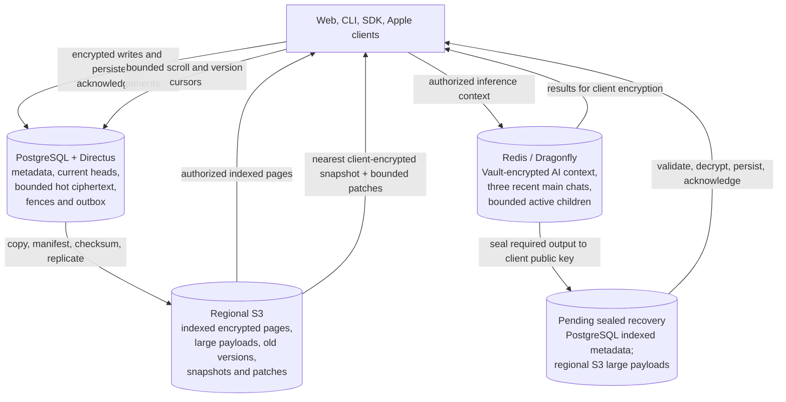

# Bounded storage for agentic coding scale

This approved plan keeps the current PostgreSQL, Directus, Redis/Dragonfly, and regional S3 foundation while making every high-volume path bounded. Both rounds of five design questions are answered. The user approved the reviewed Plan and authorized implementation on 2026-10-03; the session records Specification approval at fingerprint `4787bd3c975408e61542722b51c6980243f87377e00619f7573770a86f705e19`. Implementation is underway, with status and dependencies in the linked OpenMates Tasks.

> “what i care about is having a proper reliable efficient and scalable solution that is still reasonable to implement in terms of effort and minimal migration risk.”

## Why this work exists

The development database measured 6.54 GiB on 2026-09-25. `directus_revisions` used 4.53 GiB (69%) and `directus_activity` used 469 MiB (7%), although those collections contain more than agentic coding data. There were no cold manifests in development.

The current cold archive code writes complete chat graphs in repeated gzip parts, then deletes individual hot rows. It omits embed diffs and commits, restores a whole graph for mutation, and does not give scrollback an indexed page reader. Version listing includes encrypted payloads without explicit pagination, allowing provider defaults to truncate long histories, and reconstruction starts from one original snapshot. Recovery and sync can still load all history, child contexts compete with three recent main-chat cache slots, and offline pending writes need a stronger durability fence.

## Before and after

| Area | Current behavior | Planned behavior |
| --- | --- | --- |
| Redis/Dragonfly | Three-chat LRU also competes with child contexts; some pending state can be treated like disposable cache | Three recent main chats plus separately bounded active child contexts; durable pending writes protected; embed byte budget measured before final tuning |
| PostgreSQL messages | Recovery/sync paths can read full history | Encrypted metadata for every chat; agreed initial defaults of up to ten recent eligible main chats, each capped at 100 messages or 2 MiB encrypted bytes |
| Compression | Checkpoints do not drive a bounded, incrementally archived page stream | Each checkpoint archives only newly covered IDs into one logical segment of small independent pages; begin benchmarks at 10–20 messages and 128–256 KiB |
| Scrollback | A whole long-chat gzip graph can be required | Stable indexed pages, independently compressed, with separately stored large payloads read under explicit transfer/cache byte budgets |
| Subchats | Child data participates in the general hot/cache lifecycle | Finished subchats archive after final delivery and all client-encrypted persistence acknowledgements |
| Unattended output | Existing sealed recovery covers final assistant text only | Within an admitted budget, all required output is durably sealed for client recovery outside Redis; failed safe saves pause further work |
| Artifact history | History lists include payloads and lack explicit pagination; reconstruction starts at the original version | Current head plus bounded recent versions in PostgreSQL; complete paginated metadata and older encrypted snapshots/diffs in S3 |
| Directus audit data | Generic revisions/activity dominate measured development storage | Collection-by-collection audit-purpose review; selectively disable unnecessary generic tracking while preserving real product history such as `embed_diffs` |
| Migration | Whole-graph archive path exists but development has no cold manifests | Copy, checksum, replicate, and read-verify in a small canary; retain PostgreSQL source copies for 24 hours after S3-read cutover, then apply every prune gate |

## Storage tiers

Redis AI context and durable client-key ciphertext are separate data classes. A capable authorized client supplies usable AI context; PostgreSQL and S3 ciphertext alone cannot refill the server-readable cache. The server may read the Vault-encrypted AI cache for inference, but it cannot decrypt client ciphertext to manufacture an artifact snapshot. Sealed unattended output survives for client recovery, but client-only ciphertext cannot restart server inference after working-cache loss. Separate startup sync caches retain their existing contract.

## Agreed lifecycle

- Keep PostgreSQL and Directus for the initial implementation. Removing the Directus API layer can be evaluated later as a separate project because the product UI does not use it.
- Keep encrypted chat titles, summaries, routing indexes, authorization metadata, and archive indexes in PostgreSQL for every chat.
- Start with up to ten recent eligible main chats in PostgreSQL and, per chat, 100 messages or 2 MiB of encrypted message bytes, whichever comes first. Archive after 30 inactive days or sooner for checkpoint-covered prefixes. These are agreed initial configurable defaults; later tuning requires measured justification and a recorded decision.
- Keep three recent main chats plus bounded active child contexts in Redis/Dragonfly. Active/new writes and durable pending writes remain protected.
- Store checkpoint-covered history as indexed immutable pages. Do not download a 300-message gzip object for ordinary scrolling.
- Append new messages in cold chats through a fenced bounded hot tail without restoring the whole archived graph. Read large payloads through authenticated chunk/range streaming or bounded-size admission, preserve full content, and defer PostgreSQL pruning of legacy formats until compatible bounded readers are verified.
- Keep the current artifact head and a bounded recent version window in PostgreSQL. Put older encrypted versions/diffs in S3 and keep their complete, paginated timestamp/graph metadata in PostgreSQL.
- Let a capable client produce encrypted periodic snapshots. Historical reconstruction fetches the nearest snapshot and a bounded patch chain for client-side decryption. Snapshot cadence and the recent PostgreSQL version window are measured engineering choices in the artifact-history phase.
- Track current shared files by references independently of chat age.
- Apply the same history limits to pinned and shared chats. Preserve pin placement and existing sharing permissions; enable shared-chat payload pruning only after archive-aware reads and revocation checks pass. Creating a share updates its authority and key references without requiring the whole transcript in PostgreSQL.
- Continue already authorized agent work after all clients close only within its admitted budget and while every required output can be durably sealed to a client public key outside Redis. This includes child transcript messages, embeds/diffs, summaries, compression checkpoints, and final assistant text. Pause further work when a required safe save fails. Retain each sealed payload and recovery locator until canonical client-encrypted persistence acknowledgement or authorized deletion, even if a recovery job lease or working cache expires; large sealed payloads may move to S3 while clients remain offline. On return, an authorized client validates and decrypts output, persists normal client-encrypted records, acknowledges them, and then ordinary archival applies.
- Preserve the existing multi-region replication, global deletion, seven-day superseded-generation rollback, export, reference safety, authorization, and encryption contracts.
- Test the first implementation against 1000 heavy daily active users and 500 simultaneous main/subchat executions, representing 500 rounds, 200 new embeds, and 1000 file versions/diffs per heavy user-day. All architecture verification uses zero real inference requests.
- Require ordinary uncached archived-message pages to be ready within one second at the 95th percentile under that load and documented reference network/device conditions. Include authorization, transfer, decryption, and page readiness in the measurement; use bounded prefetch and local caching for subsequent scrolling.
- Begin page-size benchmarks at 10–20 messages and 128–256 KiB before compression. Final page sizing, large-payload transfer/cache byte budgets, snapshot cadence, recent artifact window, and Redis global byte budgets are measured engineering choices in their implementation phases, not new user approval gates.

## Staged implementation

1. Inventory actual row/byte/age distributions, revision/activity purposes, cache working sets, and target user-day volume. Configure selective Directus tracking and measure the write/storage effect while retaining historical records. Define rollback metrics before retention changes.
2. Add stable cursors, byte/count budgets, metadata-only listings, and supporting indexes across sync, recovery, messages, archives, and version history.
3. Add the indexed page writer/reader, separate large payload objects, durable archive outbox, generation fences, checksums, and replication-verified manifests. Keep PostgreSQL authoritative.
4. Connect compression checkpoints, recent-chat bounds, child-context budgets, and finished-subchat archival to those safety fences. Extend existing X25519/AES-GCM sealed final-response recovery to all required unattended outputs and propagate recovery identity and public keys into child dispatch. Store small fenced pending-recovery indexes in PostgreSQL and large sealed payloads in regional S3; Redis remains working context. Pause when a required save fails. Client finalization and acknowledgement precede ordinary archive eligibility. Apply history limits to pinned/shared chats with verified archive-aware sharing and revocation before pruning.
5. Add paginated version graphs and client-created encrypted snapshots so version 101 and thousand-edit histories reconstruct with bounded reads.
6. Run a throttled initial canary: copy, verify, replicate, read through the new path, and compare results. Keep PostgreSQL source copies for 24 hours after S3-read cutover.
7. Exercise the actual processing and storage pipeline with deterministic synthetic provider responses at the accepted load target. Measure staged-load latency, page/compression distribution, reconstruction, restore, migration, rollback, deletion, revocation, shared references, and exports, with zero real inference requests. Pass these checks before the first real-data prune; then prune only units whose durability, acknowledgement, compatibility, generation/write-fence, and rollback checks pass.

## Capacity testing without inference

The model/provider boundary supplies scripted streaming messages, tool calls and outcomes, child-agent responses, and compression summaries. The real application handles processing, scheduling, encryption, persistence, recovery, version history, and archival against isolated PostgreSQL/Directus, Dragonfly, and object storage. Generated histories establish realistic age and table sizes; ongoing API and worker traffic proves processing behavior beyond simply inserting rows.

Reuse the existing signed `TEST_LIVE_MOCK` full-pipeline replay path and credential-free isolated CI stack. Its LLM/HTTP caches fail on missing entries and its guards count provider calls per task. Add the concurrent workload driver, generated multi-turn/child-agent fixtures, aggregate run receipts, and an independent network deny/audit. The faster event-replay shortcut skips preprocessing, compression, and main processing, so it is useful downstream coverage but insufficient by itself.

Inference credentials are absent, real provider dispatch and network access are blocked, and missing simulation coverage fails the test. The same rule covers routing, compression, embeddings, fixture recording, and any suggested live canary. Every run must prove zero real inference requests. Fixtures are generated deterministically or reused from already approved replay data.

The initial workload represents 1000 heavy user-days: 500,000 rounds, 200,000 new embeds, and 1,000,000 file versions/diffs, with a separate target of 500 simultaneous main/subchat executions. Paced steady traffic, bursts, and accelerated data-volume runs are reported separately. Actual encrypted payload sizes, clock assumptions, test hardware/network, latency, queue lag, database/WAL growth, memory, and object-store operations accompany the results. This verifies infrastructure capacity and data integrity; it makes no claim about model reasoning quality or real-provider response time.

For ordinary uncached archive pages, the initial p95 gate is 1000 milliseconds from request initiation through authorization, transfer, decryption, and requested-page readiness. Test pages start absent from the client and application payload caches. Warm/prefetched reads, separately loaded oversized payloads, and timeouts/failures are reported explicitly; fast response headers alone do not satisfy the gate.

## Safety gates

Implementation must cover duplicate and reordered pagination, concurrent writes/checkpoints/archive/promotion/deletion, failed database or S3 writes, checksum mismatch, missing parts, offline pending-write persistence, multi-user authorization, Team revocation, shared references, deletion in every region, complete bounded exports, version 101+, a thousand-edit reconstruction, and UI scroll/decrypt behavior. Parent synthesis keeps any required child result available until consumption is acknowledged. Snapshot publication requires current write permission and version fencing; legacy histories retain their dependencies until a capable writer supplies safe checkpoints.

Unattended output requires durable client-key-sealed recovery outside Redis before dependent work continues. The pending recovery index must remain small and fenced in PostgreSQL, with large sealed payloads in existing regional S3. A recovery job lease or working-cache expiry cannot delete the only durable sealed output or its locator. Normal archive eligibility follows client validation, decryption, client-encrypted persistence, and acknowledgement. Ordinary interactive reads fetch small pages; explicit complete exports traverse every required page incrementally.

The 2026-10-01 source follow-up found a reusable recovery foundation: final assistant text can already be sealed to a client recovery public key, persisted, and later decrypted and finalized by an authorized client. Its schema-1 payload contains a single final response. Extending it to every required output is now an agreed behavior; child key provisioning, per-output versions, budgets, and safe cache-loss behavior belong to the recovery implementation phase. Its current seven-day recovery expiry is not adopted as user-data retention. Client-only sealed output cannot automatically restart server inference after cache loss without client-supplied context. No Vault-readable durable history substitute is authorized.

Archive eviction and PostgreSQL payload pruning remain disabled until all supported clients can read the indexed format. A canary must copy, verify, and read successfully before prune; it must have explicit throttles, pause conditions, an observation window, and a tested rollback. Existing history cleanup is a separate destructive action and needs an exact approved scope.

The user reports few current users. For the initial small cohort, enable verified S3 reads after targeted zero-inference correctness, authorization, replication, client-read, and rollback tests. Retain PostgreSQL source copies for 24 hours after cutover. Before the first real-data prune, pass the full zero-inference load and lifecycle checks, confirm every supported reader is compatible, and satisfy per-unit integrity, durability, acknowledgement, generation/write-fence, and rollback gates. A failed gate pauses pruning and invokes the tested rollback path. Explicit deletion remains immediate. This source-copy buffer does not delay steady-state compression, subchat archival, or prompt processing; the separate seven-day rule applies only to superseded archive generations.

## Decision history

All five refinement questions were answered on 2026-10-01. The user approved the reviewed Specification and Plan and authorized implementation on 2026-10-03.

1. **Answered 2026-10-01 — pinned and shared eligibility: A.** Use the same bounded history policy. Pinned chats stay pinned, shared readers retain authorized access, and shared-chat pruning waits for verified archive-aware permissions and revocation. There is no permanent unlimited-history exemption.
2. **Answered 2026-10-01 — no capable client online: A.** Already authorized agent work continues within budget only while every required output can be durably sealed outside Redis for client recovery. Pause further work if a required output cannot be safely saved. Client finalization precedes normal archival; saved client-only ciphertext does not restart server inference after cache loss.
3. **Answered 2026-10-01 — first load-test scale: A, with zero real inference.** Target 1000 heavy daily users and 500 simultaneous main/subchat executions using the representative 500-round/200-embed/1000-edit user-day. Exercise actual processing with generated provider outputs and fail before external dispatch when simulation coverage is missing.
4. **Answered 2026-10-01 — archived-page responsiveness: A.** Initial p95 target is one second for first-time uncached pages, including transfer and client decryption, under the agreed load and documented reference network/device. Bounded prefetch and local caching support subsequent scrolling.
5. **Answered 2026-10-01 — initial rollout buffer: A.** Enable verified S3 reads after targeted checks, keep PostgreSQL source copies for 24 hours after cutover, then prune only after all verification gates pass. The interval affects redundant source-copy removal only; explicit deletion remains immediate.

TASK-2774 remains the only work-status and dependency ledger. This documentation does not create a parallel task list.

## Document checks

The approved storage Specification validates. The Plan now explicitly uses the repository's supported lightweight profile and passes `plan_validate.py`; OpenMates Tasks retains the status and dependency ledger. Implementation checks are recorded below as they complete.

## Implementation evidence — 2026-10-03

### Weekly storage billing extension

The user added weekly credit billing for excess S3 storage and approved deletion
of unpaid data after four weekly warnings. [billing-extension.md](billing-extension.md)
records the exact personal allowance/rate, logical-byte metering, immutable weekly
settlement, delivered-warning timeline, final payment check, protected expiration,
and legal-copy work. TASK-9893 owns this additional outcome. Team payer policy is
awaiting the user's answer; no new archive charge or real-user deletion is enabled.

The privacy/terms audit found missing storage-price and unpaid-retention disclosures
and an unsupported user-retrievable 60-day export-backup claim. The legal sources
and canonical privacy mirror are being corrected with focused rendering and
translation checks. Four-warning and expanded-billing claims must match the
implementation activated at release.

Plan conformance is **partial**. The implementation remains in progress; no full-capacity result, production activation, real-user pruning, or historical audit cleanup is claimed.

### Implemented candidate foundation

- Selective Directus tracking retains intentional artifact history. Indexed query, cache, and archive budgets are configurable. All-chat metadata remains in PostgreSQL.
- Message pages use exact checkpoint-covered IDs, independently compressed ciphertext, separate oversized payloads, durable upload intents, generation/write fences, and fresh verification of every configured replica before pruning.
- Typed unattended recovery covers required child prompts, messages, summaries, checkpoints, embeds, and diffs. Discovery has a completion fence; client acknowledgement follows canonical persistence. Pending sole copies survive cache and lease expiry.
- Artifact discovery is paginated; current heads and a bounded version window stay warm. Clients create encrypted periodic snapshots and reconstruct with bounded patches.
- Current Team authority, shared references, Project links, explicit deletion, and complete exports have focused coverage. Actual PostgreSQL/S3 race probes and integrated client verification remain required.
- Web/CLI head and wrapper writes retain encrypted retry state and require durable receipts. Bundled message attachments are being tightened so failed saves cannot produce a message acknowledgement.

### Source-bound evidence

Candidate `4d4d09e4ca08a6e59c7958ef0be06523063bebbf` passed 171 isolated backend tests: runs `37133553698` (43), `37133556128` (46), and `37133558463` (82). Component preview `37133518055` passed 2/2; shared bounded-history browser run `37134416371` passed 1/1. These receipts belong to that earlier source, not later fixes. Its recovery run was canceled and its processing pilot stopped before the workload; neither proves processing or capacity.

Integrated candidate `56bac1387c2c99309235033d70f3de53ddb31580`, based on development `6f87b4739e9b73e12c2ab19a5e49636ade05fc9d`, preserves newer Workflow, Project, privacy, Team, and CI changes. Preparation `37136581420` passed. Its three backend batches stopped before assertions because one pip transaction combined incompatible backend/SDK dependency pins. The focused-install harness repair was published as tooling-only commit `3053414ea2c50d4dfa0990e1211931fe09cf2b26`; 22 local runner tests pass.

The `56bac` processing run `37137509239` failed. Its send/delete browser result was insufficient evidence of a durable assistant response, and the PostgreSQL/S3 probe exited with its detailed error private. The next source adds a canonical assistant-row assertion and sanitized probe failure location/class. It also repairs a duplicate cache-service argument, with 29 focused recovery tests passing, and narrows the isolated HTTP allowance needed for internal encrypted persistence while keeping external providers blocked. No real inference request or completed workload result is claimed.

Recovery run `37137512097` timed out after 1200 seconds with incomplete results: child, embed/diff, and checkpoint assertions saw no pending outputs. Source inspection found the isolated recovery protocol still at its default disabled epoch, and the test closed the originating client at user-message acceptance rather than confirmed output publication. The next isolated fixture activates that protocol only in its disposable environment and verifies publication before disconnect. This diagnosis is inferred from source; no matching discovery-frame receipt was captured. No recovery success is claimed.

Startup run `37137515053` passed four of five cases, including oversized exact fetch. The remaining fixture count is corrected to include the separately seeded shared chat. Shared setup run `37137517527` failed at a real TOTP boundary before browser execution; the E2E-only auto-generated-code timing repair passed six fake-clock cases. These repairs require a fresh candidate run.

The actual merged local transaction checks passed 71 recovery cases and 23 embed cases before the subsequent bundled-write repair. The later bundle-only transaction stores the head and both wrappers atomically, checks current chat/Team/preflight authority, and rejects changed retry ciphertext or keys. Its explicit materialized checks passed 28 transaction tests and 16 focused Python tests; sender ciphertext reuse and fail-closed preparation remain under verification. Those numbers do not attest to a later source. Required source-bound CI is being coordinated by the capacity Task; processing/recovery, PostgreSQL/S3 probes, supported-reader compatibility, rollback, and latency/load remain open.

### Latest isolated integration evidence (2026-10-03)

Candidate `28a47f7e4cd9d13d42df6056875f9034ca687a9b` used trusted runner `20cb6a714a1a801dfbc003def5e84c055140cc11` for shared E2E preparation and backend batches. Preparation run `37144146329` passed. Backend batch B passed 76/76 account/recovery/reference cases. Batch C passed 56 cases and failed one native metadata fixture assertion; batch A failed one Team exception-identity fixture. Both fixtures are corrected without changing production behavior or weakening assertions; their focused rerun is pending.

Selected unit run `37145080690` used the same product source with harness `a797822c8f3d545b4d0a910e50fb9bcd16f8cce8`: CLI embed durability passed 3/3. UI collection found a missing WebSocket listener mock, while the journal test found an actual obsolete variable in batch message saves. Both are repaired and the batch transaction/journal behavior has been independently reviewed. CLI provisioning tests stopped before assertions because their required build output was absent; the selected runner now builds that package first, with 16 focused runner checks passing. These repairs still require their selected CI rerun. Browser processing/recovery/startup/sharing jobs remain under the capacity Task's verification; no successful full workload or capacity result is implied.

The corrected Team embed and native metadata nodes passed 1/1 each on candidate `c1c1c25413460c7cba6b5bd7e6a37a885ef0e2eb`, harness `8f25249ce752252c7d70e7bd84b12e75f99be633`, runs `37146141022` and `37146143162`. Its selected unit run `37146145424` passed the repaired IndexedDB journal case, CLI embed durability 3/3 and CLI command surface 4/4. Two timing tests encountered the test loader's source-import rewrite; their test-only built-module URL correction passed 6/6 locally with that loader. The sender suite still stops during import; standard stack diagnostics are being added before another mock change. New c1 E2E preparation passed on trusted harness `4f2710ceeec0d8f15adb2bb68f4bed6cc7425c10` (run `37146315929`); its four browser consumers have no terminal success yet.

The exact selected sender diagnostic then captured the import cycle: `projectChatPreviewService` and `assistantSpeechController` register with an undefined `chatSyncService` before any test case collects (run `37147798687`, c1 product / c8e961 diagnostic harness). A test-only EventTarget mock now isolates that incidental singleton. No production change or weakened assertion was needed. Only the sender and timing test files require their focused rerun; the successful journal and embed durability receipts remain separate.

Fresh c1 / 4f2710 browser receipts passed shared bounded history 1/1 (run `37147221439`) and startup 4/5 (run `37147224365`). Startup's remaining case selected the separately seeded one-message shared chat on a timestamp tie; the helper now requires at least four persisted messages before trimming, preserving the exact four-message assertion. The processing browser's first case passed a signed encrypted turn, canonical assistant persistence and reload (run `37147218720`), but the second case stopped at an empty editor before saving its code attachment or running the PostgreSQL/S3 workload. It now uses the existing verified editor-focus helper and adds a typed-prefix assertion. Recovery is still pending. These remaining changes are test-only and require focused reruns; no capacity or PostgreSQL/S3 workload success is claimed.

Source-28 processing and recovery consumers then failed during isolated recovery-epoch activation, before any browser workload (`results=[]`). Their receipt excluded the private child-process exception, so a sanitized function/line/exception-class diagnostic and probe construction check are being added before a focused rerun. Neither run proves processing or recovery behavior.

Product changes remain in reviewed private candidates. Only the approved Specification, Plan, Apple handoff and scoped CI tooling have been published to dev. No shared API/schema activation, Apple implementation, real-user archive cutover or pruning has occurred. The Mac chat can pull the published contract documents now and must pull the actual backend implementation commit when announced.

### Apple ownership and activation

The user's separate Mac chat owns all Apple implementation and native verification. The published [Apple handoff](apple-handoff.md), commit `73565e35e98de2e9e9868b17953deb0c58eaa90a`, gives exact writer, bounded-reader, typed-recovery, and version requirements. Backend scratch Apple proposals are excluded from the candidate.

Do not activate the strict key-parent writer enforcement or archive rollout on shared services until native compatibility and release policy are settled. Turning archive switches off alone does not protect old senders from a newly activated key-parent guard. Coordinate the web/backend receipt transition as well: a new web sender requiring a digest must not be published against an API that cannot supply it.

### Remaining rollout gates

All archive actor switches default off. Targeted correctness/read/replication/rollback checks precede S3 read cutover; PostgreSQL source copies then remain for 24 hours. Real pruning additionally requires all supported-reader receipts, full zero-inference lifecycle/load evidence, and every per-unit durability, authorization, acknowledgement, reference, and generation fence. Explicit authorized deletion keeps its separate immediate contract.

The current four-worker CI runner cannot prove 500 simultaneous executions. The 1000-heavy-user-day/500-execution benchmark needs suitable isolated hardware. Five hundred client connections are not evidence of five hundred active executions. No operator rollout, restore, ownership transfer, or real-user deletion command has run.

The warm PostgreSQL budget still needs a separate artifact inventory. A current
encrypted head and up to 32 recent encrypted versions are retained **per artifact**;
that per-artifact window does not bound the total payload across new, low-churn
files. For illustration only, 200 new heads per day would create 200 × days
heads before any deletion or eligible whole-graph archival. Their actual
ciphertext size, metadata/index growth, and reachability determine the SQL
cost. P-7 must measure current-head bytes, recent-version bytes, warm transcript
bytes, cold S3 bytes, and row/index growth separately. Whole-graph copy and
head-removal eligibility have not been verified for this workload, so this
example is not a measured growth rate or a claim of permanent retention.

See [rollout.md](rollout.md) for exact-source receipts, pause, verification, and rollback procedures. The linked Tasks remain the work-status authority.

Source `410b0c510f8aa25b4fc28cc6c4b27b5a183f034c` / trusted harness `c8e961da9281a85667208d05b446d03f7964d4a2` passed all five startup cases (run `37149906271`). Its pilot passed the signed encrypted turn and saved-code upload/preflight/canonical-message checks, but failed the visible artifact reference after reload (run `37149903865`); the PostgreSQL/S3 workload did not execute. The sender encrypted original message text rather than the final artifact-reference content; that product fix is being verified.

Scoped source `9e6aa906580ad1af66a914e2c353738964558246` includes the child-completion fixture, signed durable-save-failure fixture, bounded recovery-ACK diagnostics, scoped Node WebCrypto sender-test setup, and regenerated assertion metadata. Four pure fixture checks pass. Recovery and selected sender CI are submitted with the capacity Task as sole monitor; no successful recovery or full-capacity result is claimed from submission. This source excludes the in-progress billing and legal extension.

Trusted selector tooling is published on dev as
`5a8873c71ada4202ed13cc030f03a47598530b15` (four tool paths only), with 28 focused
runner/coverage checks and deployment gates passing. Source
`b1502a02feda56b5b1bd34ff961ff8c59c00f5be` uses that harness and adds canonical
artifact-reference encryption, secret-key-derived retry-stable artifact IDs,
exact client-encrypted preflight journals, and versioned ACK cleanup. Its selected
UI tests passed 18/18 across five suites (run `37153512068`). Signed artifact reload
and independent processing/PostgreSQL/S3 pilot runs are submitted, not passed.

Recovery source `9e6aa906580ad1af66a914e2c353738964558246` / c8e961 passed two of
four cases (run `37152181694`): sealed checkpoint recovery and pausing synthesis
when durable child prompt save fails. Child assistant/summary publication still
failed, and embed recovery reached a canonical head ACK but canonical diff reads
returned 409. Both remaining defects are under bounded investigation. These
results are incomplete recovery evidence and do not authorize archive pruning.

The additional weekly-billing candidate includes a private-source-bound isolated
metering probe and separate OFF/ON REST specs for actual upload/page bytes, logical
key deduplication, Team attribution, conflicting metadata, and owner isolation.
Its unit, translation, and static checks pass. The actual PostgreSQL/S3 probe,
weekly-ledger integration, settings component preview, and new billing contract
review remain pending; new archive charges and protected expiration remain off.

Recovery candidate `0ab9a791042d3544cde0bfc5250b690feb53e6c5` / trusted harness
`4240242427e88ec0c0dcbc4d27e44b80083d5e0d` carries the narrow initial-child
inference-identity fix and initial-version `snapshot_required` recovery handling,
with supporting tests and bounded private failure diagnostics. Relevant backend,
UI classifier, and four-case recovery checks are submitted; submission does not
establish a pass.

The independent b150 pilot (run `37154455456`) passed its signed encrypted
browser turn, then failed in probe service initialization before any PostgreSQL/S3
transaction. The probe is being changed to the existing narrow runtime-service
initializer. The b150 saved-code bundle check (run `37154452517`) passed its
preflight and canonical head/key checks but failed the rendered artifact after
reload. The local IndexedDB ciphertext still contained the original fenced
Markdown and its synced status prevented canonical hydration from replacing it;
exact local/canonical ciphertext reconciliation is being fixed. Neither failed
run establishes storage capacity or permits source pruning.

The coordinator retrieved successful focused receipts for 0ab9/424: backend
`test_stream_consumer_recovery.py` (run `37155522319`) and UI
`recoveryEmbedSource.test.ts` (run `37155525057`). The recovery E2E remains
pending. The saved-code reload correction now reconciles the exact canonical
ciphertext into the optimistic local row before dispatch; its selected unit and
existing signed browser checks require a new source-bound run.

A source audit confirms the scheduled chat archival path copies message segments
only. Artifact current heads do not move through that sweep. The separate dormant
whole-chat graph archive has no product caller, omits `embed_diffs`, and lacks
Project/cross-chat reference checks before removing an embed row; the Project
reader still requires that row. It must not be enabled to solve artifact warm
capacity. The newest 32 version-number positions are a normal-writer window,
not a demonstrated account-wide byte budget. An archive-aware artifact-head
reader and verified ownership/reference handoff are required before this
remaining SQL-growth limitation can be claimed resolved.

Billing warning evidence has a separate unresolved delivery gate. The current
email ledger marks HTTP-accepted provider submissions as sent, without retaining
message IDs or correlating recipient delivery/bounce events. Its notice ACK is
not proof of the proposed four delivered warnings; new expiry remains disabled.
The billing review defines the required stronger behavior, while the candidate
still needs that receipt implementation and integrated proof.

Trusted archive failure diagnostics are published as dev
`827d2708abe7ab88dbbf7abaf0bebb7d28278ab9` (two tool paths only). Candidate
`2166be4ed05cff8df75563bbfc896793c93bd010` uses that harness, includes the
non-Celery archive-probe initializer and exact optimistic user-ciphertext
reconciliation, and preserves billing@5. Selected sender, signed bundle, and
independent PostgreSQL/S3 pilot checks are submitted, not passed. The separate
0ab9 recovery run remains in progress without an unchanged rerun. No new billing
code, archive reader activation, payload pruning, or real-user deletion was
published in these tooling commits.

Tooling provenance correction: the canonical owning assertions are
`storage.background.complete-sealed-recovery` for the 4240242 recovery diagnostic
change and `storage.validation.synthetic-capacity` for the 827d270 probe diagnostic
change. Their shorthand commit trailers used noncanonical assertion names; the
infrastructure tests and source-bound product evidence remain separately traced.
