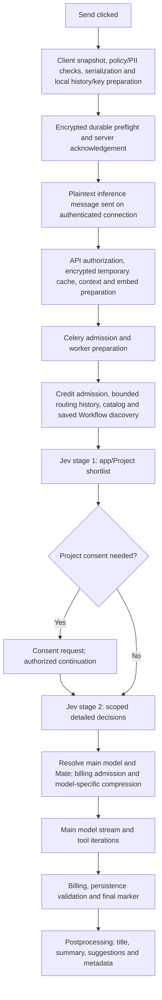
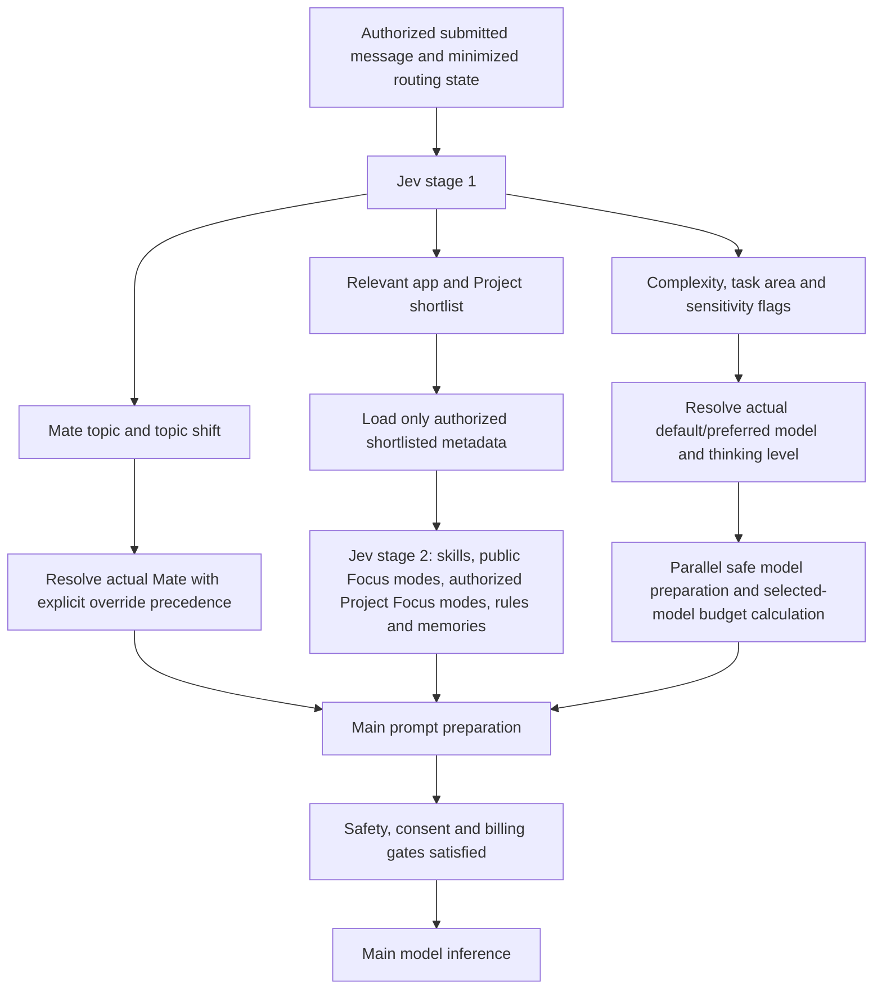

# Chat latency investigation and improvement proposal

Revision 1, 2026-10-10. Diagnosis and planning only. Task: `12fb2012-be42-46f1-958c-babc378f1d02`.

The highest-value first changes are immediate composer handoff, bounded saved Workflow discovery, and earlier model/Mate routing. Typing-time Jev requests are an optional experiment after those changes. The measured Workflow preparation interval is substantially larger than the measured Jev decision interval in the four closely inspected dev turns.

## What was established

| Finding | Evidence | Implication |
| --- | --- | --- |
| Web renders the pending message before it clears the composer. | Optimistic dispatch at `sendHandlers.ts:2088`; clear at `:2243`, after `sendNewMessage`. Existing tests assert this ordering. | The reported overlap follows the current lifecycle and can be repaired independently of model latency. |
| Apple also clears after accepted submission. | `ChatView.swift:4580–4629`; send preparation and preflight in `ChatViewModel.swift`. | Apply the intended immediate handoff to both clients. |
| Most inspected preprocessing delay occurs before Jev. | Four retained dev turns: median 3.60 s before Jev, 0.477 s from Jev start to analysis result. | Moving Jev earlier while retaining the preparation bottleneck saves only a fraction of the wait. |
| Saved Workflow discovery performs extensive sequential hydration. | Four intervals of 2.48–3.19 s each contained 38 Workflow reads, 35 Vault decrypt calls and two authentication calls. Source loads every Workflow summary before applying the 20-candidate cap. | Replace UI-style list hydration with bounded routing metadata retrieval. |
| The first Jev stage does not choose complexity or Mate. | It shortlists apps/Projects; detailed stage selects complexity/topic. Exact model and Mate resolution follow detailed preprocessing. | Reorganize the existing two stages to match the requested contract. |
| Both configured simple and complex defaults use Gemini 3.8 Flash. | `processing/model_routing.py:28–40`: LOW versus MEDIUM thinking. | Complexity currently changes reasoning configuration, not necessarily the model identity. Preferences and overrides still take precedence. |
| Long web chats can perform excessive rendering work during streaming. | Every chunk updates the history array; old-message lookup is quadratic; virtualization is disabled while any message streams. | Profile and reduce whole-history work while preserving the existing incremental renderer. |

## Evidence and limits

Read-only dev evidence was collected on 2026-10-10 around 08:27 UTC. Investigation began at commit `64c9ff539162308ce50ee0d03c1f7d438f7f0770`; the runtime checkout reported `1ec68002178408634781ff9fd653c12694ac91e2`; the isolated Plan workspace started at `faae158b110cc1b20aa2861ea35c7fec3305e990`. The principal suspect files matched byte-for-byte across these checkouts when compared. Historical traces and already imported Python modules are not thereby proven to use those revisions.

The trace sample uses the most recent 300 matching AI phase spans within seven days. The cap was reached, so this is a bounded diagnostic sample. Counts differ by phase and include different request types and terminal paths. Do not add these medians or treat them as population p50/p95 performance.

| Measured phase | Observations | Median | Maximum |
| --- | ---: | ---: | ---: |
| Worker queue | 44 | 10 ms | 6.73 s |
| Worker service setup | 45 | 31 ms | 36 ms |
| Preprocessing | 40 | 3.87 s | 7.70 s |
| Main phase, including model/tool work | 45 | 18.61 s | 104.77 s |
| Final billing | 39 | 681 ms | 2.63 s |
| Postprocessing | 42 | 2.97 s | 3.79 s |

A separate 250-span query contains 38 turn records, including 37 completed turns with first-token timing. Median worker-start-to-first-token is 12.38 s, ranging from 8.32 to 34.81 s. This excludes client preparation, API processing and preflight before worker admission. The first recorded token need not be the first visible answer prose, especially in tool flows.

In four paired retained worker-log turns, the interval before Jev is 3.25–3.76 s; the two-stage Jev adapter interval is 0.433–0.534 s. Eight successful direct TypeSafe preprocessing attempts account for these four turns. No fallback appeared in that paired sample. The catalog-to-Jev interval contains repeated Workflow blob reads/decrypts consistent with the source path. Logs can interleave concurrent work, so exact child-call attribution needs dedicated discovery spans. The code mechanism is independently confirmed.

The complete sanitized aggregates are in [baseline-summary.json](baseline-summary.json). No private prompts, responses, Workflow titles, account identifiers or credentials are stored here. No new real-inference requests, product tests or runtime mutations were needed for the diagnosis.

## Current processing flow

The exact order of client policy checks varies by client. Web's optimistic row appears partway through client preparation, before the preflight wait finishes. Composer clearing waits until its sender returns. New chat IDs and client-encrypted chat/key records are prepared before inference; generating the chat title is a separate matter. On the healthy Jev path, title and summary generation are already deferred until after the answer. They should stay off the time-to-first-answer path.

Project candidates enter compact routing earlier than the ordinary path. A selected Project can return a consent request before detailed inference. Project specialist metadata can currently require an additional decision before consent. An authorized continuation reuses the app shortlist and runs scoped detailed preprocessing. Explicit Focus mentions and deterministic Workflow invocations have separate shortcuts. Preserve these paths rather than forcing every turn through two requests.

Each logical Jev stage can partition into up to eight physical requests, with at most three concurrent calls and a 12-second aggregate deadline. Provider calls use a three-second timeout and one retry, with TypeSafe followed by OpenRouter where permitted. Failure can then invoke independent generative preprocessing. These bounds can create a long tail; they did not cause the four healthy paired examples.

### Why Workflow discovery is slow

`preprocessor.py:2414` awaits `discover_workflow_metadata` before starting Jev. That helper creates a new synchronous `DirectusWorkflowRepository` and `WorkflowService`, then runs `saved_workflow_metadata` in a thread. The helper calls the general `list_workflows` method. The repository retrieves all records with `limit=-1`, projects schedule state, and builds every summary. Summary construction separately loads and decrypts title, description, category and icon. Only afterward does discovery retain its maximum of 20 candidates and discard fields it does not need.

This work scales with saved Workflow count and decryptable metadata fields even for a message unrelated to Workflows. A fresh repository also creates a new HTTP client and authentication state. The broad list method is useful for UI administration but is expensive on a foreground inference path.

## Proposed first-stage contract

Stage one must include all inputs needed by the existing selector: complexity, task area, China sensitivity and user-dissatisfaction signals, plus Mate topic/shift. Jev supplies bounded decisions; application code resolves the exact permitted model and Mate. User overrides and preferences retain their precedence.

Stage two receives only shortlisted app catalogs and eligible metadata. Unactivated Projects expose only the existing consent-eligible metadata; private Project Focus details, rules, memories and file contents require authorization. Selecting a Project or Focus never grants execution permission. Resume should reuse the valid stage-one result while rechecking scope and revisions.

Moving the decisions alone does not remove a network round trip. Its benefit comes from starting model/Mate preparation early and avoiding unrelated catalog hydration. Main inference still waits for final skill selection, safety, consent and billing. Model-specific compression must use the selected answer model's budget, never Jev's smaller context budget.

## Implementation sequence

### R1 — Immediate composer handoff on web and Apple

Before: pending history appears, but the submitted document stays in the input through preflight. After: local submission captures the document, stable message ID and draft revision, presents a pending row and clears that submitted composer without awaiting remote acceptance. Continue validation and transport from the captured snapshot. Retain encrypted retry state and show explicit failure/retry behavior; failure must not overwrite a newer draft or execute twice.

This gives an immediate perceived improvement, independently of AI speed. Target local handoff below 100 ms at p95 on agreed devices. It is an acceptance target, not a measured result. Main risks are lost retry content, duplicate sends, stale draft restoration and PII checks reading the now-empty editor. Preserve snapshot-based checks and ownership/version fences. Test local persistence failure, delayed acknowledgement, attachments, anonymous sends, new typing and reconnect. Effort: medium, including web/Apple parity and coverage.

### R2 — Bounded Workflow metadata discovery

Before: hydrate all UI summaries, then keep 20 candidates. After: select a bounded owner/Team-scoped candidate set before reading encrypted payloads; retrieve required blobs together and batch Vault decryption, using the existing `decrypt_many_with_user_key` utility. Request only title/description, current version and selection fields; avoid icon/category and schedule projection when routing does not need them. Reuse correctly scoped connection/authentication facilities.

Use a short-lived encrypted metadata cache with explicit revision invalidation where it improves repeated sends. A cache miss still reads authoritative storage. A request-local authorization snapshot can remove duplicate reads, but freshly authorize selected bodies and versions before use. Do not share an async encryption client across the per-call event loops used by the current synchronous Workflow bridge; use a coherent async discovery path or a deliberately managed batch bridge.

The inspected 2.48–3.19 s interval provides a realistic upper bound on this slice's opportunity; the replacement still has real I/O cost. The expected improvement is seconds for accounts with many saved Workflows, not a universal fixed saving. Risks are stale metadata, narrowed candidate recall and owner/Team leakage. Preserve existing discovery intent and evaluate candidate selection with more than 20 Workflows; do not arbitrarily omit a clearly relevant older Workflow just to hit a timing target. Effort: medium.

### R3 — Early routing and the remaining shared critical path

Implement the stage-one contract above after R2, with dedicated spans for catalog preparation, Workflow discovery, each Jev stage, Project authorization and pre-main setup. Include client click/local handoff, preflight acknowledgement, worker admission, first visible answer and final marker timing. Export structural timings only.

Fetch unique provider health keys in a batch instead of repeatedly checking every skill before app shortlisting. Build static app/Mate catalogs once per revision and load detailed hints only for shortlisted apps. Overlap independent authorized metadata reads and safe model preparation. Preserve current safety results, explicit model/Mate overrides and every degraded-path fallback.

The API also reconstructs and re-encrypts client-provided history sequentially (`message_received_handler.py:1645–1752`), and its normal cached-history loop decrypts records individually. Batch by a single authorized user key and preserve message IDs, ordering, embedded native context and recovery semantics. This is an additional source-based opportunity; its latency was not separately measured. WebSocket handlers are awaited on the connection receive loop, so long message handling can also delay later control frames. Any asynchronous dispatch must retain ordered mutation and cancel/idempotency guarantees.

Evaluate main-provider time separately: select a representative text-only cohort, distinguish reasoning delay, provider TTFT, tool-first responses and long tool loops, and compare the existing simple LOW/complex MEDIUM configuration before changing defaults. A provider switch or lower reasoning effort is not justified by mixed trace durations alone. Final billing and postprocessing are separate measures: titles already run after the final marker, and removing them will not speed the first answer. Effort: medium to large, staged and reversible.

### R4 — Responsive long web chats while streaming

Preserve the current 80 ms render coalescing, stable block reuse and incremental ProseMirror updates. Replace repeated `messages.find` lookups with an ID index and update only the changed assistant row. Keep virtualization for unaffected history while pinning the streaming row and preserving scroll anchors. Avoid rescanning completed answer prefixes for embeds; batch persistence for incognito as well as ordinary chats where its storage contract allows it.

Actual responsiveness needs profiling. Existing convergence tests exercise a rendering harness; add a real ActiveChat case with a long message history and active composer typing, on phone and desktop sizes. Measure bounded render work, typing-to-paint and frame stalls rather than simply increasing waits. Main risks are scroll jumps, embed/PII render drift and lost final content. Effort: medium. This can proceed independently of R2/R3 once implementation is requested.

## Typing-time Jev preprocessing

The idea is technically feasible, but an unrestricted request after every typing pause is not the first recommendation. In the paired sample the entire two-stage decision interval is only 0.43–0.53 s. Speculating stage one can hide only its own duration; its individual duration has not yet been measured. Eliminating the unrelated seconds of discovery work has substantially more potential in that sample.

Let `L1` be stage-one duration and `h` the time available between a draft preview starting and Send. For an exact reusable result, saved time is at most `min(L1, h)`; edited drafts or changed context can save zero. Expected savings must include eligible-draft fraction and valid-result hit rate. Do not present the full four-second preprocessing interval as a speculative gain.

TypeSafe currently lists Jev 1.13 at $0.042 per million input tokens, with no output charge. A 5,000–10,000-token preview therefore costs $0.00021–$0.00042 in supplier spend. A million such previews costs $210–$420. Three previews per submitted message cost $0.00063–$0.00126; a valid cached stage-one hit replaces one otherwise-needed call, while abandoned drafts replace none. The observed eight preprocessing calls used 65,148 tokens and cost $0.002736 total, approximately $0.000684 per paired two-stage turn. These are supplier costs, not a proposed user-credit tariff. [TypeSafe model pricing and limits](https://docs.typesafe.ai/models).

Capacity is a more immediate scaling risk. The documented account limits are 80 requests/s and 100,000 input tokens/s and may change. At the observed median 8,108 tokens/call, the token limit accommodates roughly 12 calls/s before other Jev uses. Even 100 concurrently typing users making one preview every five seconds would produce 20 calls/s and about 162,000 input tokens/s. Real sends, safety, Workflows and relevance ranking share capacity. This is an illustrative load calculation, not current user traffic. [TypeSafe model limits](https://docs.typesafe.ai/models).

If R2/R3 measurements justify an experiment, start with stage one only and a 750–1,250 ms debounce, one in-flight request, at most two previews per active draft session and an account token budget. These are initial experiment settings, not established optima. Give submitted turns priority and disable previews during rate pressure. Use no preview retry, OpenRouter/generative fallback, tools, chat creation, billing side effects, private Project loading, summaries or compression. Requests may still incur provider cost after cancellation; do not assume cancelled means free.

Bind any result to authenticated actor and personal/Team scope, canonical submitted content including redaction/attachment projection, history/summary revisions, model/Mate overrides, active Focus/Project activation and catalog revision. A changed dependency invalidates reuse. An in-flight matching preview can be joined only within the foreground deadline; otherwise use normal processing. Never accept a prefix result as final safety or authorization. Main model and tools still wait for submitted-turn gates.

This also changes privacy behavior: unsent text that the user might erase would leave the device before Send. Begin with an explicitly reviewed, opt-in first-party preference, minimized content and no raw-content logs; exclude anonymous/incognito, background tabs, composition/IME and unsupported attachment cases initially. CLI scripted calls have no useful typing interval; Apple may use the same experiment only if adopted with the same draft policy. Measure extra spend, abandoned previews, exact-match ready hits, first-visible-answer improvement, rate-limit incidence and impact on foreground p95. Stop the experiment if the observed gain is small or foreground latency worsens.

## Which clients benefit

| Issue/change | Web | Authenticated CLI | API-key CLI/SDK | Apple |
| --- | --- | --- | --- | --- |
| Composer clears after acceptance | Yes | No graphical composer issue | No graphical composer issue | Yes |
| Saved Workflow discovery and shared two-stage routing | Yes | Yes on shared first-party path | Routing shared; first-party-only Workflow discovery is skipped | Yes on shared first-party path |
| Preflight, keys and history preparation | Yes | Yes | Different REST/recovery/persistence path | Yes |
| Whole-history browser rendering | Yes | No | No | Separate native renderer; not established as the same problem |
| Draft speculation opportunity | Optional | No for normal scripted sends | No for full-request API calls | Optional, same privacy policy |
| Time until output is shown | Progressive | Progressive authenticated stream | Current SDK send waits for full response; API-key CLI prints it afterward | Progressive |

Apple adds asynchronous PII verification, serialization/model routing and possible latest-history-window loading before send. It returns accepted after preflight and the socket write, without awaiting the AI response. Authenticated CLI prepares memory/privacy/history/key state, waits for preflight and message confirmation, then prints streamed chunks. Current API-key CLI uses the SDK's full-response path; saved SDK sends additionally poll recovery and persist the encrypted answer. If SDK users need fast visible output, expose a proper streaming API as a separate follow-up scope; backend optimization alone cannot make a full-response API emit partial text.

## Verification and rollout proposal

R1 and R2 are the first implementation batch. R3 follows the bounded discovery path; R4 can be independent. E1 remains an optional experiment. Use narrowly scoped feature switches and retain the current send/routing path for rollback during comparison. Cache/schema changes must be revisioned and old cache entries ignored safely.

Update the existing `message-input.send.ownership` and draft assertion coverage with immediate local handoff, failed-send retry and newer-draft protection. Reuse `sendHandlers.lifecycle.test.ts`, `sendHandlers.test.ts`, component composer coverage, Apple send/composer tests, `test_saved_workflow_context.py`, `test_preprocessor_jev.py`, Project-consent coverage and current render/scroll suites. Add cases that test bounded I/O counts and a real long-history streaming chat. Product REST/WebSocket, CLI/SDK and browser checks use isolated GitHub CI; paid-inference comparisons remain bounded dev checks under the repository rules. Deliver the CI recordings when those tests actually run.

Before implementation, resolve the exact product assertion for clearing/retrying and record the requested stage-one contract in the applicable Specification. This report defines a proposal, not a new approved permanent contract. No implementation Tasks or deployments are implied by the draft recommendations; OpenMates Tasks remains the execution-status authority.

## Source references

References below are pinned to the initial review commit. The suspect files were also compared with the runtime and Plan workspace.

- [Web optimistic history dispatch and later composer clear](https://github.com/glowingkitty/OpenMates/blob/64c9ff539162308ce50ee0d03c1f7d438f7f0770/frontend/packages/ui/src/components/enter_message/handlers/sendHandlers.ts#L2088)
- [Web durable preflight acknowledgement](https://github.com/glowingkitty/OpenMates/blob/64c9ff539162308ce50ee0d03c1f7d438f7f0770/frontend/packages/ui/src/services/sendersChatMessages.ts#L2312)
- [Apple accepted-send composer clearing](https://github.com/glowingkitty/OpenMates/blob/64c9ff539162308ce50ee0d03c1f7d438f7f0770/apple/OpenMates/Sources/Features/Chat/Views/ChatView.swift#L4580)
- [Apple send pipeline](https://github.com/glowingkitty/OpenMates/blob/64c9ff539162308ce50ee0d03c1f7d438f7f0770/apple/OpenMates/Sources/Features/Chat/ViewModels/ChatViewModel.swift#L5973)
- [Jev stage-one app/Project routing](https://github.com/glowingkitty/OpenMates/blob/64c9ff539162308ce50ee0d03c1f7d438f7f0770/backend/apps/ai/processing/jev_preprocessing.py#L361)
- [Detailed Jev decisions](https://github.com/glowingkitty/OpenMates/blob/64c9ff539162308ce50ee0d03c1f7d438f7f0770/backend/apps/ai/processing/jev_preprocessing.py#L404)
- [Blocking saved Workflow discovery](https://github.com/glowingkitty/OpenMates/blob/64c9ff539162308ce50ee0d03c1f7d438f7f0770/backend/apps/ai/processing/preprocessor.py#L2414)
- [Workflow discovery service construction](https://github.com/glowingkitty/OpenMates/blob/64c9ff539162308ce50ee0d03c1f7d438f7f0770/backend/apps/ai/processing/context_preselection.py#L76)
- [Candidate cap applied after summary hydration](https://github.com/glowingkitty/OpenMates/blob/64c9ff539162308ce50ee0d03c1f7d438f7f0770/backend/apps/workflows/skills/saved_workflow_context.py#L31)
- [Unbounded persisted Workflow list](https://github.com/glowingkitty/OpenMates/blob/64c9ff539162308ce50ee0d03c1f7d438f7f0770/backend/core/api/app/services/workflow_service.py#L719)
- [Workflow summary decryption](https://github.com/glowingkitty/OpenMates/blob/64c9ff539162308ce50ee0d03c1f7d438f7f0770/backend/core/api/app/services/workflow_service.py#L2610)
- [Existing Vault batch decryption utility](https://github.com/glowingkitty/OpenMates/blob/64c9ff539162308ce50ee0d03c1f7d438f7f0770/backend/core/api/app/utils/encryption.py#L999)
- [Tier defaults and thinking levels](https://github.com/glowingkitty/OpenMates/blob/64c9ff539162308ce50ee0d03c1f7d438f7f0770/backend/apps/ai/processing/model_routing.py#L28)
- [History reconstruction on the API critical path](https://github.com/glowingkitty/OpenMates/blob/64c9ff539162308ce50ee0d03c1f7d438f7f0770/backend/core/api/app/routes/handlers/websocket_handlers/message_received_handler.py#L1645)
- [History rendering and streaming virtualization](https://github.com/glowingkitty/OpenMates/blob/64c9ff539162308ce50ee0d03c1f7d438f7f0770/frontend/packages/ui/src/components/ChatHistory.svelte#L913)
- [Authenticated CLI sender](https://github.com/glowingkitty/OpenMates/blob/64c9ff539162308ce50ee0d03c1f7d438f7f0770/frontend/packages/openmates-cli/src/client.ts#L8181)
- [TypeScript SDK full-response path](https://github.com/glowingkitty/OpenMates/blob/64c9ff539162308ce50ee0d03c1f7d438f7f0770/frontend/packages/openmates-cli/src/sdk.ts#L2208)
- [Python SDK full-response path](https://github.com/glowingkitty/OpenMates/blob/64c9ff539162308ce50ee0d03c1f7d438f7f0770/packages/openmates-python/openmates/sdk.py#L3176)
