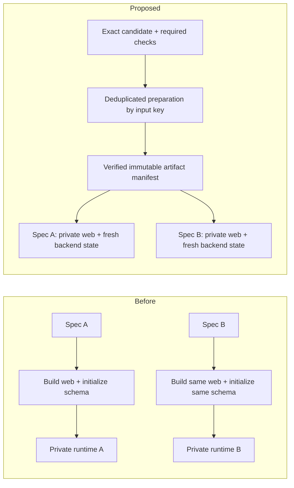

# CI and agent efficiency review — EFFICIENCY-2, revision 1

2026-09-20. Inspected repository revision `f8a382e856150959e45b508afd2cbedc316b8c93`.
This is a diagnosis and proposed design, not an implementation/completion claim.
It supplements the approved [latency design](latency-improvements.md); it does not
create a second Task ledger or authorize changes to other chats.

## Decision summary

The isolation architecture is worth keeping. Its expensive preparation is not
yet shared effectively, and contradictory instructions/enforcement add avoidable
iterations. More parallel agents or a wholesale orchestration rewrite would not
remove those causes.

| Change | Expected benefit | Principal risk |
| --- | --- | --- |
| R1: one scoped verification policy, enforced consistently | Catch cheap failures before CI; remove surprise work/approval gates. High confidence from observed hook blocks and deployment retries. | Accidentally relaxing a real safety or product-contract requirement. |
| R2: prepare immutable artifacts once; create fresh runtimes per spec | Remove repeated web builds and schema initialization. High confidence about removed work; final latency unmeasured. | Stale/incomplete artifact keys, incorrect schema restore, leaked bootstrap data. |
| R3: focused selection, fair admission and accurate phase receipts | Prevent broad-suite noise, component starvation and misleading queue reports. High confidence about mechanisms; throughput depends on actual GitHub capacity. | Starving heavier work or duplicating uncertain remote dispatches. |

Existing CI approval covers the previously described artifact reuse and focused
verification work. Changes to instruction triggers, hook policy, implicit proof
requirements and deployment acceptance are newly proposed here, not activated.
No production change, shared-dev testing, local browser-testing lane, new paid
capacity, or interruption/resumption of another chat is part of this review.

## What has actually improved

| Measurement | Before | Observed after |
| --- | ---: | ---: |
| Same transcript component, GitHub job duration | 15m48s | 1m52s |
| Same component, request to coordinator terminal receipt | 16m47s | 9m31s |
| Component coordinator admission wait | 24s | 7m18s |
| Representative full-stack web/CLI build | 4m08s | 2m36s |
| Representative full-stack backend startup | 8m45s | 6m17s |

The component comparison uses runs [35505162425](https://github.com/glowingkitty/OpenMates/actions/runs/35505162425)
and [35512002770](https://github.com/glowingkitty/OpenMates/actions/runs/35512002770).
The latter's workflow lifecycle was 1m58s; its actual test job was 1m52s. The
7m18s admission delay is not included in that job duration. These are individual
samples, not median/p95 claims. Full-stack phase samples use the earlier component
run's full environment and [account preflight 35512471425](https://github.com/glowingkitty/OpenMates/actions/runs/35512471425);
different assertions mean their whole-job times are not an apples-to-apples comparison.

Prebuilt API, Directus and setup images really are reused, with compatibility
labels and recorded immutable digests. Component jobs now use Vite without Docker,
backend, production build or CLI build. But shared web/CLI build outputs and
canonical focused pytest selection are not implemented. Prepared schema image
publication passed at 14:15:07 UTC; successful full consumer restore was still
unproven in this review. Do not call publication proof of end-to-end readiness.

## The two named chats

### Audio — `01a0bb0e-849e-7993-b87d-de509612fa37`

- Original work reached green required checks by 13:39:59. Deployment completed
  at 13:51:38: an additional 11m39s including missing provenance trailers,
  missing test-contract metadata and a gate failure in unrelated existing tests.
- A new iPad issue arrived at 13:53:52. Do not count that new scope as failure to
  finish the earlier task. The agent had a concrete diagnosis by 14:01:47.
- Three new checks were submitted at 14:11:55 and dispatched at 14:12:02.
  GitHub jobs started at 14:12:10, :12 and :15. They were genuinely concurrent;
  the 14:15 chat claim that they were waiting through the queue was inaccurate.
- The two browser jobs each pulled compatible images in 66–69s, rebuilt web/CLI
  in 2m38–41s, then initialized their backend in 6m12–14s. Their logs explicitly
  reject the then-published prepared schema because its compatibility key differs.
  The fixed schema finished publishing only after their image selection.
- [Audio browser run 35515753168](https://github.com/glowingkitty/OpenMates/actions/runs/35515753168)
  passed at 14:26:56 (14m46s job); [report browser run 35515757499](https://github.com/glowingkitty/OpenMates/actions/runs/35515757499)
  passed at 14:24:35 (12m20s). These results arrived after that chat's turn was
  interrupted; they do not establish deployment of its new fix.
- [Pytest run 35515755354](https://github.com/glowingkitty/OpenMates/actions/runs/35515755354)
  failed after 6m49s. The canonical lane runs the broad backend suite, not the
  requested regression subset; relevant passing cases do not make the whole run green.

### Newsroom preview — `01a0bed6-baf9-75b1-bffa-43ca9e893084`

- 13:57:17 implementation authorized; 14:20:40 user interrupted. About 23m23s
  elapsed, including roughly seven minutes of construction, four of metadata/
  classification, and eleven of repeated CI iterations. These are elapsed
  intervals, not estimates of human effort or model compute time.
- First candidate sent two viewport jobs together. Both failed on the same
  Svelte syntax error before useful rendering: duplicate expensive feedback.
- Second candidate reached CI but failed preview rendering/readiness; the phone
  job also waited about 2m36s for admission behind other work.
- Third candidate rendered and failed a real horizontal-overflow assertion in
  [run 35516070816](https://github.com/glowingkitty/OpenMates/actions/runs/35516070816).
  Keep that assertion: a genuine UI defect is not a reason to weaken tests.
- A cheap compile preflight and one common preview-readiness contract would
  remove the first failure classes. Responsive checks still matter once the
  common prerequisite works. No deployment was completed in this reviewed turn.

## Root causes and instruction conflicts

1. **Full jobs repeat independent preparation serially.** Images → web/CLI build
   → backend setup → browser installation → assertions. Each spec repeats it.
   Isolation needs fresh state, not repeated compilation/schema construction.
2. **Published images are not a complete artifact lifecycle.** Mutable `dev`
   discovery plus per-ref publisher cancellation can lose a needed generation.
   Consumers fail safely to expensive initialization/builds, but no single
   completed manifest makes a whole compatible set available. Schema keys omit
   producer/sanitizer code and a bundle format; mutable vendor base tags also
   need resolved digests in provenance/invalidation.
3. **One global four-job cap covers fast and slow profiles.** No owner fairness
   or protected lightweight admission. Four is local policy, not a verified
   GitHub account limit. Raising it alone repeats more expensive preparation.
4. **Allowed checks are blocked by actual hooks.** `AGENTS.md` and testing policy
   permit focused local unit/lint/build checks; `safe_bash_guard.py` rejects almost
   all pnpm/npx commands. Runtime logs show Svelte checking blocked at 14:04:32
   and ESLint blocked at 14:05:59. This is observed behavior, not merely prose drift.
5. **Scope policy and deeper skills disagree.** `verify-plan` still describes a
   fixed API/CLI/SDK/web/Apple ladder and real dev API checks. Top-level policy
   says affected surfaces only and isolated GitHub product tests. Two UI skills
   independently prescribe the component-preview workflow.
6. **Optional proof becomes an executable requirement.** `plan_verify.py`
   requires demonstration/video evidence for schema-versioned Plans unless an
   exemption/waiver is supplied. Top-level policy says proof media is required
   only when explicitly requested/in scope. Test metadata requirements can also
   surface only at deployment, after expensive verification.
7. **Agent execution added avoidable delay.** In this CI improvement task, two
   schema packaging mistakes (excluded dump, then unreadable file permissions)
   caused extra producer/consumer cycles. A restore smoke check in the producer
   should have caught them. Repeated waiting/status narration also obscured which
   phase was actually running. There is no measured attribution of minutes to
   hook execution itself; do not blame hook count or model speed without timing.

## Prior decisions found in the last two weeks

- September 7, chat `01a07cde-f630-76c3-9a46-66eb7c082d85`: the user rejected a
  28-page workflow Specification and clarified that Specifications are for
  OpenMates product features, not engineering workflows. Companion review
  `01a07d1a-8df2-7992-9459-c5214ab855cc` identified that approval cycle as delay.
- September 7–8, chats `01a07d05-4f27-7111-91fb-9ef6fa875c9b` and
  `01a07d75-0889-7460-a6a8-82d040971bfa`: repeated unchanged orchestration messages
  and prolonged completion/verification loops prompted explicit changes: use
  events, stop unchanged nudges, and keep worker instructions tied to new evidence.
  Context-specific requests for large overnight campaigns are not blanket
  authorization to spawn unlimited ordinary work.
- September 9, chat `01a08601-183f-7b23-b3ed-5bc4cfb2bf3a`: the user cut speculative
  AI workflow features from v1, requested a deterministic MVP, and later authorized
  saving approved Specifications without implementing them. A false-triggered hook
  also interrupted that thread. Approval of a document is not automatically
  approval of implementation when the user expressly separates them.
- September 10, chat `01a08bf8-7171-7d13-87df-9fb1f1e105c9`: after a broad example
  campaign failed to provide useful progress, the user requested one example at a
  time with approval and feedback before the next. This supports feedback-driven
  slices for subjective work, not an approval pause after every routine code edit.
- September 11: the [approved efficiency cleanup](../codex-efficiency-cleanup/plan.yml)
  and [implementation commit 343888bf9](https://github.com/glowingkitty/OpenMates/commit/343888bf9)
  already established lightweight plans, bounded debugging, concise output and
  reduced polling/deploy retry waste. The Plan references chat
  `01a08fff-fdcb-7270-97bf-76e608bed3b5`; that original transcript was not found in
  this local audit, so this point is corroborated by the durable Plan and commit,
  not presented as a freshly read user quote.

The recurring problem is not absence of a simplicity policy. The policy was
approved and partly implemented, while older skills and executable gates retained
different behavior. R1 should remove that contradiction, not add more prose to
the top-level instructions. Official [OpenAI guidance on simplifying skills and
prompts](https://developers.openai.com/blog/rethinking-skills-and-prompts-for-gpt-6-astra)
also recommends narrow skill triggers, progressive disclosure and revisiting
over-prescriptive testing instructions; the incident evidence above is the basis
for this repository-specific recommendation.

## R1 — Make accepted scope the only source of required work

**Before (observed):** a scoped fix attempts local checking, is blocked, discovers
syntax/metadata issues later, and can encounter extra proof gates at completion.

**After the proposed change (expected):** one verification entry point returns the
affected checks, relevant contract requirements and accepted waivers before CI.
The same manifest governs final acceptance; unrelated requirements cannot appear
later without a meaningful source/scope change.

- Keep `AGENTS.md` concise: ownership, safety, permission boundaries, canonical
  commands, completion scope. It is already substantially simplified; fix the
  deeper contradictions instead of appending another policy layer.
- Repair parsed command policy or provide one approved local-check wrapper for
  lint/typecheck/unit/compile. Continue prohibiting local product/browser E2E and
  shared-runtime mutations. Avoid a blanket allowlist that permits arbitrary
  scripts just because they are named `lint`.
- Make `verify-ui-change` route to one component-proof definition; narrow triggers
  to affected visual/interaction behavior. Reuse existing tests and preview fixtures.
  Do not force a new fixture/spec for every mechanical UI file edit.
- Require only explicit Plan/Specification acceptance. Remove default video,
  fixed cross-client ladders and generic PDF/approval ceremonies for engineering
  repairs. Retain explicit approval for actual product-contract changes.
- One Task per user outcome; children only for independently deliverable approved
  work. No Task per procedural step. Plans hold intent/design, Tasks hold status,
  CI holds evidence. A stale Task cache is not permission to expand scope.
- Check with the user at material scope changes, uncertain product intent, or
  repeated failed approaches—not after every routine step. Preserve prior waivers.

Effort: small-to-medium bounded policy/enforcement change, plus focused fixture
tests; no runtime replacement. Risk is misclassification of dangerous commands
or genuinely required proof. Test an allowed static check, denied product E2E,
real destructive command, routine regression, semantic feature requiring approval,
explicit proof request and explicit waiver. Rollback only changed policy/hooks;
keep existing worktrees and evidence. Activate hooks only through existing review.

## R2 — One preparation phase, independent runtime consumers

Sequence in plain language: capture one candidate; prepare each missing artifact
once; validate and publish the complete manifest; let independent jobs fetch
the same bytes while creating separate runtimes/accounts/databases.

**Before (observed):** the two audio E2Es independently spent about 2m40s on the
same web build and over six minutes on schema/backend startup.

**After the proposed change (expected):** one input-keyed producer supplies runtime
images, sanitized schema and required web/CLI outputs; both jobs restore those
into fresh volumes and run their own web processes. Components bypass this heavy
path and remain Vite-only GitHub jobs.

- Extend the existing coordinator, not a second scheduler. It owns deduplicated
  preparation dependencies; producers need not consume all consumer admission
  slots or wait behind consumers that depend on them.
- Keys include complete inputs, lockfiles, toolchain/build configuration,
  build-time public environment, producer/restore code, bundle format and resolved
  base-image digests. Start web reuse with the same candidate; broaden only after
  invalidation tests. Publish an atomic checksummed manifest after all checks pass.
- Stop unrelated `dev` pushes cancelling still-needed CI producers. Split their
  lifecycle from broad self-host release publication; use input-key ownership.
  Existing self-host publishing remains, but stops writing the new CI artifact
  namespace after cutover. Avoid two competing producers for the same key.
- Restore-test each schema image before publication: fresh PostgreSQL permissions,
  normalized equivalence to cold initialization, auth/credential rotation,
  no application/private data, and two independent consumers. An image that only
  builds successfully is not ready for consumers.
- Mount the full verified candidate source, including deletions, into compatible
  dependency images. Share artifact bytes only—never containers, DB volumes,
  accounts, browser profiles, sessions or mutable caches.
- Build CLI only for checks that consume it. Serve copied web assets without a
  web container. Overlap pulls/browser preparation/backend readiness where memory
  measurements permit; do not blindly run all CPU-heavy steps simultaneously.
- Keep an explicit cold path for misses, migration tests and rollback; every use
  reports its reason. During fast-path canaries a fallback does not satisfy the
  warm-performance acceptance criterion.

Effort: largest package, medium/high uncertainty because artifact identity and
restore correctness need real integration tests. Implement schema producer
validation first, then shared web/CLI output, then safe overlap. Risk includes
stale code, invalid schema and incomplete manifests. Canaries must prove source
deletions, dependency/schema invalidation, corruption rejection, signup/persistence,
two concurrent fresh environments, shared-dev rejection and complete cleanup.
Rollback consumers to the existing cold isolated path; no mutable shared state
or irreversible migration is introduced.

## R3 — One verification request and trustworthy scheduling/results

**Before (observed):** a requested regression invokes the broad backend suite;
a 1m52s component waits 7m18s behind full jobs; agents call running setup “queued.”

**After the proposed change (expected):** one source-bound request selects exact
node IDs/specs, admits work fairly and returns phase-specific completion evidence.

- Integrate the existing focused pytest workflow capability into the canonical
  candidate path. Preserve the full suite for explicit/nightly selection. Never
  convert a broad-suite failure into a claimed focused pass.
- Preflight compilation, test collection, contract metadata, prerequisites and
  deployment provenance once before expensive fan-out. For a brand-new preview,
  establish one common render/readiness proof before viewport fan-out; do not
  serialize independent known-good specs merely by habit.
- Keep total concurrency bounded/configurable, add owner fairness and protected
  lightweight capacity. Increase limits only against verified quota/budget and
  measured load; report the throughput tradeoff of reserving a slot.
- Deduplicate preparation and same-candidate checks. Supersede only undispatched
  older work with the same owner and scope. Preserve unrelated/running work;
  reconcile ambiguous dispatch rather than dropping its admission reservation.
- Report coordinator wait, GitHub wait, artifact preparation, pull, schema restore,
  readiness, assertions and cleanup separately plus total request-to-result time.
  Use existing result events/one bounded waiter, not model-driven polling loops.
- Use earlier validation receipts only for identical inputs/harness. Deployment
  still checks integration/conflicts and changes after candidate capture; it must
  not re-run unchanged expensive checks to repair a commit-message trailer.

Effort: medium; selection and phase reporting can precede scheduler changes.
Risks are unfair admission, false reuse and duplicate dispatch. Test two owners,
saturated heavy work plus a component, an ambiguous dispatch, cancellation,
duplicate submissions and a genuine failing selected test. Keep daily broad-suite
coverage. Rollback scheduling/selection independently without deleting queue state.

## Acceptance, sequencing and feedback

R1 plus cheap preflight first; R2 schema validation and R3 focused selection can
then proceed independently. R2 shared builds precede concurrency expansion.
No giant task tree: these are three outcome packages with a review of actual
evidence after each, not three promises of completion.

Performance targets, not measured claims:

- Three comparable warm component samples complete their GitHub job within two
  minutes each; pursue the earlier 60-second warm goal separately. Current 1m52s
  proves the lightweight path, not consistent one-minute feedback.
- Prepared backend becomes healthy within 60 seconds after required artifacts
  are present. Target warm full-job setup within two minutes, then add actual
  assertion duration. Cold preparation and image downloads stay visible.
- Under a controlled multi-owner load, components are admitted without waiting
  for a full E2E generation to finish. Measure total feedback too; do not claim
  victory from job duration while queue time remains seven minutes.
- Report three warm samples per representative profile, one cold preparation and
  one invalidation, with exact source/harness and cleanup. Do not label three
  samples a reliable p95. Broader percentile claims require a larger later sample.
- Show the user the measured delta, failed criteria and any material tradeoff
  before expanding implementation. No threshold is met by weakening assertions,
  silently skipping checks or using a shared backend.

## Alternatives and maintenance boundary

Keeping the existing system retains roughly ten minutes of preparation per full
job. Only increasing concurrency may shorten queueing but duplicates that cost.
More isolated local stacks introduce the resource conflicts the user rejected.
The recommended design reuses the existing worktrees, Tasks, coordinator and
GitHub runner isolation; it changes artifact lifecycle and contradictory policy.
Do not add another orchestration service, per-chat status ledger, agent framework,
host-local browser lane or mandatory report format.

## Evidence and source references

Inspected named chats and GitHub job/step logs on 2026-09-20, chiefly 13:30–14:27
UTC; earlier baseline runs supply the before/after comparison. Coordinator SQLite
was opened read-only. Codex runtime logs corroborate actual guard rejections.
Available OpenCode logs end September 7 and do not explain today's Codex runs.
This is bounded incident sampling, not an exhaustive attribution of every chat gap.
Raw transcripts, user issue details and credentials are not included here.

- [Admission and one-spec splitting](https://github.com/glowingkitty/OpenMates/blob/f8a382e856150959e45b508afd2cbedc316b8c93/scripts/ci_coordinator.py#L428)
- [Serial job preparation](https://github.com/glowingkitty/OpenMates/blob/f8a382e856150959e45b508afd2cbedc316b8c93/.github/workflows/isolated-tests.yml#L163)
- [Runtime compatibility keys](https://github.com/glowingkitty/OpenMates/blob/f8a382e856150959e45b508afd2cbedc316b8c93/scripts/ci_runtime_images.py#L21)
- [Publisher cancellation](https://github.com/glowingkitty/OpenMates/blob/f8a382e856150959e45b508afd2cbedc316b8c93/.github/workflows/publish-selfhost-images.yml#L58)
- [Broad pytest path](https://github.com/glowingkitty/OpenMates/blob/f8a382e856150959e45b508afd2cbedc316b8c93/scripts/ci_run_tests.py#L643)
- [Command denial](https://github.com/glowingkitty/OpenMates/blob/f8a382e856150959e45b508afd2cbedc316b8c93/scripts/safe_bash_guard.py#L147)
- [Implicit proof gate](https://github.com/glowingkitty/OpenMates/blob/f8a382e856150959e45b508afd2cbedc316b8c93/scripts/plan_verify.py#L189)
- [Contradictory verification ladder](https://github.com/glowingkitty/OpenMates/blob/f8a382e856150959e45b508afd2cbedc316b8c93/.claude/skills/verify-plan/SKILL.md#L43)

The Markdown document is the review artifact. Available local PDF renderers were
not installed; no renderer installation, upload pipeline or private-log publication
was added merely to deliver this proposal.
