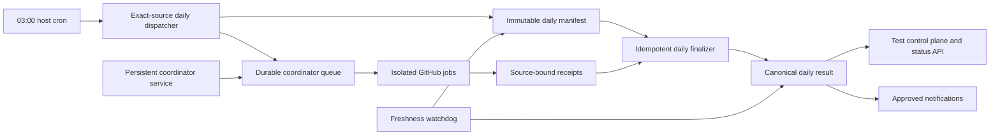

# Daily CI reliability recovery

## Goal

Restore one trustworthy daily-test control loop: the 03:00 UTC trigger selects an
exact `dev` commit, the durable coordinator executes every admitted job, one
source-bound daily result is finalized, status consumers advance, and a missed or
incomplete run becomes visible without interpreting silence as success.

This is an engineering workflow repair under the approved
`isolated-github-tests` Plan. It does not change product behavior and needs no
product Specification.

## What is actually broken

The host trigger has not stopped. It created a daily manifest at 03:00 UTC every
day from 2026-09-09 through 2026-09-22. The 2026-09-22 manifest selected source
`6e6e30623e5891c5bc08a22f7a3fa8ce5b3806d0`, admitted 202 jobs, and held 62
unmigrated specs. All 202 admitted jobs reached terminal coordinator states: 107
successes and 95 failures. GitHub records 204 workflows for that source when the
two preparation workflows are included, from 03:00 through 09:33 UTC.

The observed "no daily runs" state is therefore primarily a control-plane and
reporting outage, with a real coordinator-lifecycle reliability defect underneath:

1. The installed crontab invokes `scripts/run-tests-daily.sh --detach`, but the
   checked-in schedule installer now expects a different direct `scripts/tests.py`
   command and would also re-enable currently held hourly/production schedules.
   `python3 scripts/test_schedule_setup.py --check` reports `test_schedule=drift`.
2. The detached dispatcher enqueues jobs and writes the manifest before calling
   `ensure_coordinator()`. From cron, its `systemctl --user`/`systemd-run --user`
   calls repeatedly fail with `Failed to connect to bus: No medium found`. Jobs
   remain durable and may drain after a manually available coordinator returns,
   but the scheduled invocation exits as failed and has no reliable wake-up path.
3. The migration deliberately stopped before daily finalization. New manifests
   contain `notifications: not_wired`; no component combines their job receipts,
   imports a normalized daily result, or calls the legacy email/Discord sender.
4. Existing consumers still read `test-results/daily-run-YYYY-MM-DD.json` or
   `last-run.json`. The latest retained canonical daily file is 2026-08-30,
   `last-run.json` was last updated on 2026-09-04, and the local test-control state
   was last updated on 2026-07-17. After the status API's seven-day lookup window,
   valid GitHub execution is rendered as no recent daily run.
5. There is no freshness contract that independently reports a missing 03:00
   manifest, a coordinator backlog, or a manifest that never finalized. Silent
   staleness is consequently indistinguishable from an idle or successful day.

The current test outcomes are not healthy either. In particular, the September
22 run has 95 failed admitted jobs and 62 held specs. Those failures must be
classified after the control path is restored; they are not evidence that the
scheduler failed to run.

## Recovery architecture

Keep host cron as the already proven trigger and keep GitHub `workflow_dispatch`
as execution. Do not move the suite to GitHub `schedule:` and do not restore any
shared-dev test execution. The coordinator becomes an installed, enabled,
linger-backed service; cron only enqueues work and never tries to create a
transient user service through a session bus.

The daily manifest remains the selected-coverage record. A new idempotent
finalizer owns completion: it reads only manifest-listed jobs and validated
receipts, classifies terminal success/product failure/infrastructure
failure/held/not-finished, and atomically publishes one canonical result. An
incomplete run is finalized as incomplete at a defined deadline rather than
remaining invisible. Reconciliation can later advance it without redispatching
jobs, with a revision and audit trail.

## Ordered implementation

### 1. Stabilize trigger and coordinator ownership

- Reconcile `test_schedule_setup.py` with the intentionally installed nightly
  launcher. Its check and install paths must preserve the live signup-email smoke
  and must not silently re-enable the held hourly/production schedules.
- Replace dispatcher-owned transient service startup with a checked-in persistent
  coordinator service installation. Verify user lingering, restart-on-failure,
  reboot recovery, and the exact repository working directory during setup.
- Make enqueue success and coordinator availability distinct recorded states. A
  temporarily unavailable coordinator must leave an acknowledged durable backlog
  and a visible health failure, never a traceback-only cron result.
- Add a bounded health command covering service liveness, oldest queued age,
  attention jobs, rate-limit/backoff state, and last successful reconciliation.

### 2. Finalize every daily manifest

- Define a versioned daily aggregate schema with source commit, selection time,
  admitted jobs, held specs/reasons, terminal counts, suite/case counts,
  infrastructure incidents, product failures, finalization status, and receipt
  provenance.
- Reuse the coordinator's validated receipt loading and reporter parsing; do not
  scrape GitHub logs or infer a suite result from workflow conclusion alone.
- Finalize atomically and idempotently. Re-running finalization must not duplicate
  imports or notifications, and overlapping focused reruns must not contaminate
  the scheduled manifest.
- Publish a compatibility `daily-run-YYYY-MM-DD.json` while existing consumers
  depend on it, and retain the new manifest/receipt identities for drill-down.
- Treat held and unfinished coverage explicitly. A partial run may be useful, but
  it cannot be labeled a complete or passing daily suite.

### 3. Restore status and freshness visibility

- Import the finalized aggregate through the existing test control plane and make
  the status API understand queued, running, incomplete, failed, and passed daily
  states. Remove the stale `last-run.json` fallback once the aggregate path is
  proven.
- Add freshness checks for: no manifest shortly after 03:00 UTC, coordinator queue
  not draining, no terminal aggregate by the agreed deadline, and status projection
  lag after finalization.
- Keep operational status local and deterministic. Human email/Discord delivery
  is a separate idempotent adapter driven by the same aggregate. Destinations must
  be explicitly approved before activation; existing historical channels are not
  inferred as current approval.

### 4. Verify, then triage test failures

- First run a small scheduled-equivalent exact-source canary through enqueue,
  coordinator restart recovery, receipt validation, aggregation, import, and
  freshness checks.
- Then observe one real 03:00 UTC full cycle. Require complete selection accounting,
  no duplicate dispatch/import, a finalized result, and a fresh status projection.
- Only after this control loop is trustworthy, group the latest failures into
  infrastructure and owned product regressions. Repair infrastructure cohorts
  before spending time on independent product assertions. Keep all 62 held specs
  visible and migrate them under the parent isolated-CI Plan rather than silently
  counting them as passed.

## Acceptance criteria

- The repository schedule audit is green and matches the installed 03:00 UTC
  command without enabling held schedules.
- The coordinator drains durable queued work after logout, process failure, and
  host reboot without a manual shell or duplicate GitHub dispatch.
- Every daily manifest reaches `final`, `incomplete`, or explicit `blocked` state;
  none remains silently unreported.
- The aggregate proves exact source, selected/admitted/held inventory, job and case
  outcomes, and infrastructure-versus-product classification.
- The status API reflects the latest aggregate within fifteen minutes of
  finalization and never presents a stale legacy artifact as the current run.
- Missing-manifest, stalled-queue, overdue-finalization, and projection-lag checks
  are deterministic and covered by focused tests.
- One exact-source canary and one full scheduled cycle pass the orchestration
  checks. Product failures may remain, but they are visible, source-bound, and
  owned; infrastructure incidents are not mislabeled as product failures.
- Notification delivery, if separately approved, occurs once per aggregate
  revision and does not gate result persistence or status freshness.

## Verification strategy

Focused local tests should cover schedule rendering/audit, cron-without-user-bus,
coordinator restart and queue recovery, finalizer idempotency, partial and held
coverage, atomic artifact publication, Directus import deduplication, status
freshness, and notification deduplication. The scheduled-equivalent canary and
full browser cycle run only through the isolated GitHub coordinator on an exact
source commit.

Preserve the existing queue database, daily manifests, receipts, and legacy result
files during rollout. Do not run the current schedule install command until its
held-schedule behavior is corrected. Rollback disables the new finalizer/status
projection while leaving the durable queue and immutable evidence intact.

## Open decision

Human notification activation needs an explicit destination choice: the existing
nightly Discord/admin-email configuration, another verified channel, or status-only
operation. This does not block scheduler, finalizer, or status repair.

## Task links

- Umbrella outcome: `da3ce961-e5bc-4114-b28f-203c2878ee9f`
- Scheduler/coordinator lifecycle: `41cb406e-4d51-4b45-bf40-f9489943e9c4`
- Receipt aggregation/finalization: `260af82e-f5ee-45cf-a90b-8a99775b2f77`
- Status/freshness projection: `848b1b8e-9b63-478c-9013-cfd5e028b290`
- Full-cycle verification: `a3853a24-3653-4f46-ac1e-74e8a407325c`

OpenMates Tasks owns execution status and the recorded dependency edges; this
document does not duplicate that ledger.
