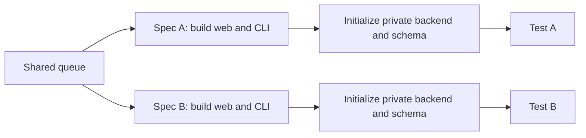
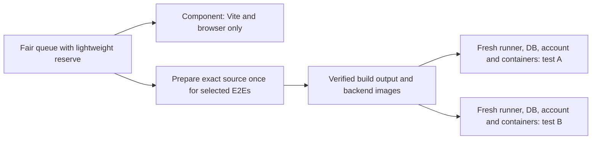

# Efficiency verification — 2026-09-20

Approved R1/R2/R3 implementation deployed as `0ef0063dc0a38db5b7d0a955273c2b609b274ca7`.
The existing coordinator service was restarted under its queue lock; the queue and
already-dispatched jobs were preserved. The personal dev CLI login is restored.

## Before and after

Before: parallel test jobs, but duplicated setup on each runner.

After: lightweight component lane, or shared immutable preparation with private
E2E state. Shared preparation's live proof is tracked below, not assumed.

## Measured component feedback

Same component spec: `components/record-audio-live-transcript.spec.ts`.
These are observed runs, not a controlled benchmark or a latency guarantee.

| Stage | GitHub job | Admission queue | Request to completion |
| --- | ---: | ---: | ---: |
| Original full-stack route, run 35505162425 | 15m48s | 24s | 16m47s to receipt |
| Earlier component-only route, run 35512002770 | 1m52s | 7m18s | 9m31s to receipt |
| Current deployed route, run 35519071678 | 1m46s | 30s | 2m23s to GitHub completion |

The large runtime reduction came from the component-only route introduced earlier.
The latest changes protect lightweight admission and expose wait phases; the
six-second runtime difference is not evidence of another major speedup.
The current run spent 13s installing dependencies, 38s installing Chromium and
30s in the selected-check step (24s Playwright duration). Application build,
CLI build, account provisioning and backend startup were all skipped. The
source-bound receipt confirms the runner-local Vite frontend and rejected shared
dev HTTPS. There were zero skipped, unexpected or flaky tests.

## Focused Python selection

Run `35519075423` passed in 1m14s job time, or 1m53s from request to GitHub
completion. The receipt records only these two selected nodes, with no broad
backend/SDK test expansion:

- `backend/tests/test_setup_schemas.py::test_prepared_schema_rotates_bootstrap_password_and_verifies_contract`
- `backend/tests/test_setup_schemas.py::test_prepared_schema_requires_old_bootstrap_login_to_be_rejected`

## Independent E2E preparation

The first producer, run `35519073495`, failed the carrier-readability probe after
351s of successful schema generation and a 10s carrier build. The probe did not
name its failing subcommand. Both dependent E2E jobs correctly failed without
dispatch; no test coverage is credited. Carrier permissions and diagnostics were
corrected in `b591c757`, and publication run `35520033189` passed those checks.
It then failed the first restore comparison. Follow-up corrections require the
final TCP listener (not the entrypoint's temporary socket-only server) before
dumping or starting dependent services, and normalize only COPY row order while
preserving exact rows, duplicates and SQL bytes. Warm restore/startup remains
unproven. Trial `35521225756`, candidate `9bee8e8b8fddfc464353573ca5ada25c725e3e64`
on harness `bbadc206165d66fb166f0675aa8a76811c6322b2`, passed ticket validation,
private source reconstruction and carrier readability, but failed the first
fresh restore at structural unit 8168: both differing lines were classified
`CREATE`. This is not explained by COPY row ordering alone. Neither consumer
was dispatched; no E2E coverage or reusable-build speedup is credited. Further
full preparation retries are paused pending a concrete structural diagnosis.

Review also corrected a confidentiality assumption: public-repository Actions
artifacts are not private. The canary source was already public, so it did not
disclose unpublished source. An immediate public-source-only guard was deployed
as `b591c75776b99cecca3da1626b8f56fa5f1aeb73`. The user then explicitly approved
using existing private storage for reusable builds. Private upload/download and
source/run-bound manifests are implemented with producer-scoped, expiring object
capabilities and read-only consumer access. Actual presigning against the existing
bucket passed; ticket file mode was 0600. Candidate Docker build-record uploads
and candidate layer exports to GitHub cache are disabled. Live transfer and
two-consumer verification are still pending; public CI logs are not a fully
private execution environment. The integrated private transport and restore
corrections were deployed as `bbadc206165d66fb166f0675aa8a76811c6322b2`;
this evidence update is the unpublished candidate used for the private canary.
That canary failed before reusable-build upload, so actual private build transfer
and two-consumer reuse are still unverified. Its only public result artifact
contained `ci-environment.json` and `ci-runtime-images.json`, with no preparation
bundle or Docker build record.

The September 21 follow-up completed R2. The schema mismatch was an equivalent
PostgreSQL partial-index text-array rendering; narrow index-line normalization
now passes two fresh restore consumers. Run `35595601411` produced the complete
private v2 web/preview/CLI bundle in 4m49s of runner time while reusing all
backend/schema images. Runs `35596093422` and `35596097182` then consumed that
same exact source and pinned harness in parallel. Both skipped UI generation,
web build, CLI build and every Docker build; both started separate containers,
databases and accounts; both selected tests passed with zero skipped, unexpected
or flaky tests. Consumer runner time was 4m42s and 4m40s. The first batch's
request-to-completion time was about 10m59s including a 6m07s preparation wait;
later tests on the same exact source reuse the successful producer directly.

Shared preparation is now the default for coordinator and dispatch-wrapper E2E
requests. `--no-prepared-builds` retains an explicit cold diagnostic path. The
schema-normalization error reported by older chats came from pre-fix harness run
`35523274307`; it is not a product-test failure and is superseded by the green
v3 restore and two-consumer evidence above.

## Debugging workflow trial

The simplified workflow and verified component lane are ready for a fresh
repository chat for issue `UZYYE`; do not investigate it in this infrastructure
chat. Full E2E verification still uses slower independent cold setup until R2's
prepared-build proof passes. This is not a claim that the complete speedup is done.
The trial should reuse available issue evidence, keep one focused Task/workspace,
run relevant local unit checks and exact isolated CI selection, then deploy the
scoped fix. New videos, broad platform verification and durable planning are not
default requirements. Material scope expansion still requires user direction.

Larger architecture changes remain unapproved. Current measurements suggest
browser installation and cold preparation are the next candidates to evaluate;
they do not justify silently adding a new scheduler or shared mutable runtime.

Two smaller follow-ups are a local enqueue wake-up for the existing reconciler
(retain steady-state API polling/backoff) and exact-version Playwright download
caching (still verify/install OS dependencies). The observed 30s admission and
38s browser step are upper bounds, not guaranteed savings. A prebuilt browser
runner image requires a separate user decision; batching specs is not recommended
because it weakens the requested one-spec isolation.
