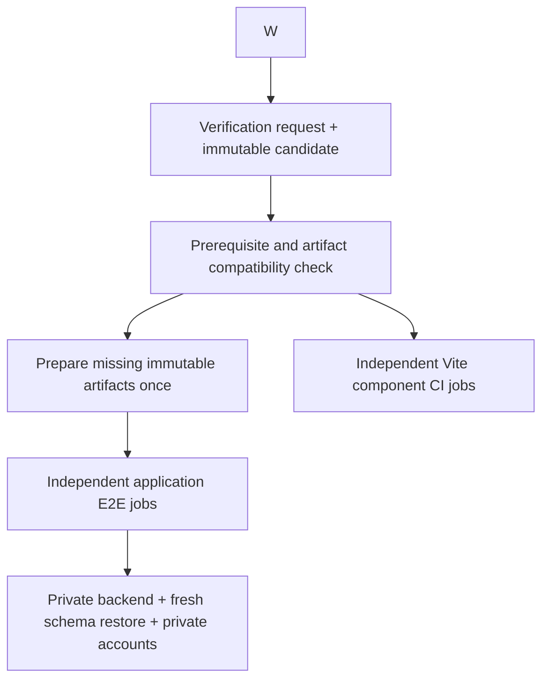

# Faster isolated test feedback — LATENCY-1, revision 2

Planning amendment to [the existing isolation Plan](plan.yml), requested on
2026-09-20 in chat `01a0be59-ae22-78c3-aaf4-1e09d96cfa36`. This records the next
implementation design; it does not activate a new runtime or claim completion.
OpenMates Tasks remains the execution authority. Package IDs below identify scope
and sequencing, not a second Task status ledger.

## Intended result

- Component checks use small, independent GitHub browser jobs. They need neither
  an application backend nor a production web build.
- Application E2E keeps one spec per GitHub job, with fresh containers, database,
  credentials and accounts. Jobs reuse immutable compatible images, compiled
  assets and prepared schema artifacts.
- A single verification request checks prerequisites and captures one candidate;
  agents receive compact results without managing duplicate generations of runs.

Login, persistence, REST/WebSocket, CLI/SDK and complete user journeys remain on
isolated GitHub CI. Real-provider checks retain their separate credential and
spending requirements. No web Docker image is needed for component jobs.

CI jobs share artifact bytes only; each job starts and owns its own runtime. A
first build for changed inputs still
costs time; producer reuse prevents every spec from paying that cost again.

## Evidence and limits

Inspected CI source: `1eef3e02bb6a89a35f7ea6a1b548b3dcc45fb4b6`; relevant workflow,
coordinator and environment files were unchanged through inspected dev
`ac0cbfe78`. Chat review covers 2026-09-20 from 09:52 UTC, not overnight idle time.

| Completed run | Web/CLI build | Backend preparation | Browser install | Selected checks | Entire job |
| --- | ---: | ---: | ---: | ---: | ---: |
| [Transcript component](https://github.com/glowingkitty/OpenMates/actions/runs/35505162425) | 4m08s | 8m45s | 36s | 6s | 15m48s |
| [Audio send](https://github.com/glowingkitty/OpenMates/actions/runs/35504775538) | 4m11s | 8m58s | 33s | 1m25s | 17m28s |

In the component run, schema setup occupied about 8m17s. The API became healthy
about 17 seconds after schema setup released it. CLI compilation took about 19s;
UI generation ran twice, followed by full server/client compilation and static
output generation. A later audio run took 13m03s, so these are samples, not fixed
costs. A newer candidate's player spec spent about 13m37s waiting for dispatch
while earlier revisions still occupied slots.

Codex logs showed one reconnect retry and one compaction in the reviewed period;
the GitHub phase timings establish the major measured delay. Available OpenCode
logs predate this work and do not explain today's runs.

Already completed: one-spec CI splitting, runner-local web, removal of the
deployment prerequisite, and bounded transient registry retries. Reuse these.

## Concrete implementation packages

### P1 — Pull compatible prebuilt images and apply verified candidate source

Before: every job runs Buildx for API, CMS and schema setup even when dependencies
and service build inputs are unchanged. The API already mounts candidate backend
source, so copying that source into another newly built image is redundant.

After:

1. Resolve an immutable image manifest recording digests, runtime platform, build
   inputs and compatibility hashes. Pin vendor images by digest as well.
2. Reuse the existing image-publication infrastructure where compatible. Current
   self-host Dockerfiles differ from CI Dockerfiles; establish parity before
   reusing their images. Prefer a CI-compatible dependency/runtime target built by
   the existing builder over blindly selecting a mutable `dev` tag.
3. Reconstruct the complete candidate using the existing base + verified patch
   transport, including additions, deletions and renames. Mount candidate source
   read-only into API/workers and preserve the required runtime support files.
   Avoid copying only changed files onto an unknown image filesystem, which can
   leave deleted or stale code behind.
4. Dependency, Dockerfile, system-package, runtime or extension build changes
   invalidate the relevant image. Build the missing compatible artifact once via
   the existing CI coordinator, then release dependent jobs. Unchanged services
   reuse their digests independently of frontend/source-only edits.
5. Record both image compatibility and candidate source identity in each receipt.
   Limit source mounts so they do not hide installed dependencies or writable
   runtime directories. Missing artifacts take an explicit cold preparation path.

Expected files: `.github/workflows/publish-selfhost-images.yml`,
`.github/workflows/isolated-tests.yml`, `scripts/ci_environment.py`,
`scripts/ci_candidate.py`, `scripts/ci_impact.py`, API/upload/Directus Dockerfiles,
and a small artifact-manifest helper if existing modules cannot own it cleanly.

Acceptance: a Python-only candidate reuses the compatible image and demonstrably
executes changed source; deleted source stays absent. A dependency change rejects
the previous compatibility key. Two jobs retain distinct containers/volumes and
pass shared-dev rejection and cleanup. Registry misses and invalid digests fail
clearly or use the declared cold path. A changed non-mounted support file cannot
silently reuse a stale image.

### P2 — Restore a prepared schema into each fresh database

Before: every spec executes the complete collection/field/relation initializer.

After: prepare a versioned schema bundle from a fresh synthetic initialization,
then import it into each job's new database. The bundle includes required
Directus metadata, constraints, indexes and deterministic initialization records,
not just table names. An allowlisted export must exclude application users,
sessions, user content, tokens and reusable credentials. Provision service secrets
and test accounts separately for every job.

Key the bundle on schema files, setup/migration/seed code, database and Directus
versions, relevant extensions and bundle format. Schema/setup changes prepare a
new bundle once. Keep the full initializer as the cold producer, fallback, and
explicit migration-test path. Compare normalized schema and required metadata
against that path before enabling the fast restore. Never derive a bundle from
dev/production data, or reuse a running database/volume between jobs.

Expected files: `backend/core/directus/setup/`,
`backend/core/directus/schemas/`, `scripts/ci_environment.py`,
`.github/workflows/isolated-tests.yml`, and proposed `scripts/ci_schema_artifact.py`.

Acceptance: two restores are equivalent to fresh initialization and independent;
real signup/authentication, persistence and reload work; old keys cannot access
another job. Tampered/incompatible bundles are rejected. A migration candidate
cannot bypass the initializer by selecting an older bundle. Export inspection
proves that no credentials or application data are retained.

### P3 — Build the web app and CLI once per relevant input set

Before: every spec repeats full web/CLI builds, duplicate UI generation and static
compression even when it does not consume the CLI or compressed files.

After: an existing-coordinator preparation job produces immutable web/CLI outputs
only when required. Same-candidate consumers download those outputs and serve
their own copies. Start with conservative keys covering source inputs, lockfiles,
generated metadata/translations, toolchain, build configuration and build-time
environment. Reuse across different candidates only when all relevant inputs are
proven identical; default to a rebuild when classification is uncertain.

Deduplicate the identical UI `prebuild`/`build` generation sequence. Use a CI-only
static configuration that omits unused gzip/Brotli generation while preserving
application compilation; leave production/self-host compression unchanged.
Backend-only changes can reuse matching frontend artifacts. UI source changes
need a new production build for full E2E, but not for the component CI profile.
A test-file-only change may reuse application assets while still running the new
test against the exact captured candidate.

Expected files: `frontend/packages/ui/package.json`, web build configuration,
`.github/workflows/isolated-tests.yml`, `scripts/ci_impact.py`,
`scripts/ci_run_tests.py`, and the P1 artifact-manifest mechanism.

Acceptance: a multi-spec candidate prepares each required build once; each job
verifies artifact identity and its served assets. Changes in translations,
configuration, lockfiles or relevant source invalidate reuse. Missing/corrupt
artifacts do not select an old build. Compare cold, first-prepared and repeat
times; producer waiting remains visible in total feedback time.

### P4 — Lightweight GitHub component lane

Before: even a pure component check takes the full GitHub application path.

After: the account-free marker selects an explicit component profile against the
immutable candidate. It starts Vite development mode and one Playwright worker on
the GitHub runner, and skips Docker/backend setup, CLI build, production-site
build, account provisioning and provider access. It preserves one spec per job,
source identity, browser evidence and shared-dev rejection. Full application E2E
still checks production-built assets, authentication, persistence and backend
integration where relevant.

Expected files: `.github/workflows/isolated-tests.yml`,
`scripts/ci_coordinator.py`, `scripts/ci_dispatch.py`, `scripts/ci_run_tests.py`,
`scripts/ci_coverage.py`, and `scripts/ci_coverage_manifest.json`.

Acceptance: representative component assertions pass on a clean CI runner
without a backend or shared-dev traffic. A component whose dependency
classification is invalid cannot silently gain a full runtime. The authenticated
audio-send spec continues through application E2E unchanged.

### P6 — One verification request, early prerequisites and compact results

Before: agents try different test entry points/environments, discover held
coverage late, and submit overlapping revisions into a four-slot queue. The
15-minute default wait can expire while a healthy 60-minute-budget job continues.

After: extend existing dispatch/coordinator entry points to preflight the exact
selection, runtime/profile availability, recorded fixtures, credentials policy
and immutable source before expensive preparation. Return required-but-held
journeys distinctly from runnable checks. Paid/provider provisioning remains a
separate action; force flags never imply available credentials or coverage.

Submit one verification manifest per candidate and collect a compact aggregate
result. A replacement request can supersede only obsolete, undispatched checks
within its own session and explicitly matching verification scope. Preserve
unrelated jobs and historical results. Running older jobs drain initially;
automatic remote cancellation is deferred until teardown on cancellation is
proven. Never credit a different source's pass to the latest candidate.

Reuse the four-slot coordinator and its shared polling/events. Add owner fairness
without assuming more GitHub capacity. Reconcile uncertain dispatch records
before reclaiming slots; do not simply stop counting jobs that may exist remotely.
Align the default wait budget with workflow duration and show queue/build/schema/
browser/check stages from cached state. Keep logs in receipts and return bounded
failures, rather than entire suite inventories or periodic agent status chatter.

Provide one focused local-test entry point that resolves a compatible Python
environment from declared dependencies, uses private environments when necessary,
and selects named unit tests. Do not repair or mutate a shared environment inside
a feature chat. Run focused checks before capturing the browser candidate, reducing
test-only follow-up snapshots. Exclude ignored private findings from publication
up front and report their exclusion rather than failing during staging.

Expected files: `scripts/tests.py`, `scripts/ci_dispatch.py`,
`scripts/ci_coordinator.py`, `scripts/ci_source.py`, `scripts/ci_results.py`,
local test environment helpers and focused `scripts/tests/` coverage.

Acceptance: duplicate submissions do not duplicate jobs/builds; a newer candidate
supersedes only matching queued work owned by that session. Other sessions make
progress. A missing voice fixture or provider prerequisite is reported before
preparation. A long healthy run does not require repeated manual reattachment.
Local environment errors are concise and actionable. The combined voice/reload
journey remains explicitly unverified until its own prerequisites and checks pass.

## Order, rollout and verification

Recommended first deliverable: P4. P1 and the conservative P3 artifact
path can proceed independently; P2 consumes their compatibility/provenance
mechanism. P6 can start with read-only preflight and compact aggregation, then
add scoped supersession after ownership regression checks. These are dependency
relationships to transfer into OpenMates Tasks when the existing login is restored.

Use focused tooling tests for artifact and dispatch behavior. Run all component
and application browser integration through the existing GitHub coordinator.
Representative canaries are
`components/record-audio-live-transcript.spec.ts`,
`components/chat-processing-indicator.spec.ts`,
`components/memory-consent.spec.ts`, and `audio-recording-deferred-send.spec.ts`.

Required correctness gates: candidate and artifact identity, invalidation, real
auth/persistence where applicable, no shared-dev access, independent CI state
and cleanup. Add a deliberate component assertion
failure to establish that the new lane reports actual failure. Do not weaken
existing assertions or substitute component evidence for a full journey.

Measure queue delay, artifact preparation, pulls, schema restore, runtime
readiness, browser readiness, checks and cleanup separately AND as end-to-end
time. Compare at least three warm representative runs, plus one cold preparation
and one invalidation run. Record source and toolchain. Warm component feedback
and prepared-backend readiness each target at most 60 seconds;
the latter starts once compatible images and schema artifacts are available.
Report total first-candidate latency alongside those targets so preparation is
not hidden. If the target is missed, retain measured evidence and identify the
remaining phase instead of claiming a speedup. No cold CI one-minute guarantee
is made before measurement.

Update `AGENTS.md`, `.claude/rules/testing.md`, the workflow quickstart, testing
architecture docs, and canonical `.claude/skills/verify-component-preview`,
`verify-ui-change`, `fix-tests` and `fix-next-test` where their actual instructions
need adjustment. Generate `.agents/skills` mirrors and run the existing parity
checks. The instructions must preserve GitHub-only browser execution and full E2E
isolation; remove superseded duplicate setup from consumers only after canaries.

Each package is reversible through the existing session deployment helper.
Fallback for components is temporarily the existing isolated E2E path if the
component profile is unavailable. Artifact misses retain cold preparation;
schema restore retains fresh initialization. A fallback never selects shared dev.
No production changes, live chat interruption,
account ownership transfer, new paid credentials or paid inference are included
in this planning request. Existing explicitly authorized provider work elsewhere
remains that owning chat's responsibility.

## Task recording

The existing engineering Project was resolved from its retained snapshot. The
global CLI rejected the planning Task creation with `Not logged in`; no Task was
created or queued. Do not manufacture linked IDs or duplicate a pending operation.
Create/link P1–P4 and P6 with the dependencies above after the existing login is restored.
This outage does not prevent review of the concrete Plan.
