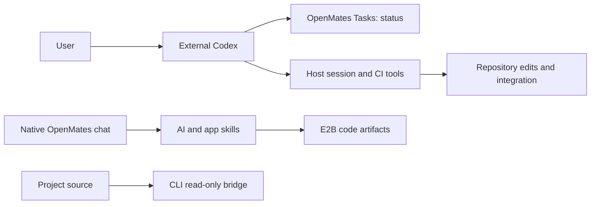
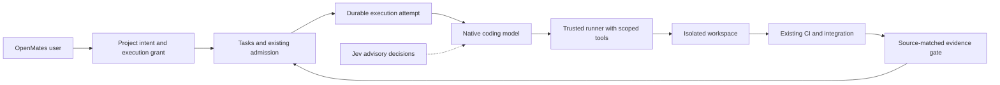

# Build real projects from within OpenMates — proposal r1

22 September 2026. Source baseline: `c2f505a5a9a5c9d6920ea0dddb36de7e6853df4f`.

OpenMates has substantial coordination infrastructure. The missing connection is a
trusted, durable repository execution lifecycle that carries a native chat from
approved intent through edits, tests, recovery, and integration. More planning
models alone will not make that connection.

Recommend a personal-Project pilot with one native OpenMates coding agent and one
registered execution host. Reuse the existing Task scheduler and OpenMates CI/session
tools. Keep Jev for bounded semantic judgments; ordinary code owns execution state.
This proposal implements no runtime changes.

| ID | Proposed change | Expected benefit / confidence | Main risk |
|---|---|---|---|
| R1 | Project-scoped execution host | Native chats can change real repositories; high confidence this is necessary | Accidentally expanding host authority |
| R2 | Durable runs and evidence-backed completion | Recover work without duplicate edits or false completion; high confidence | Migrating current Task completion behavior |
| R3 | Connect project intent, specifications, checks, and context | Work remains tied to reviewed requirements across sessions; high confidence in need, medium in final UX | Duplicated document authority and stale approvals |

The initial useful batch is R1 plus the minimum R2 ownership and completion gate.
Do not release write access first and add lifecycle protection later. Rich
Specification editing and Jev supervision can follow the first working coding loop.
The largest uncertainty is end-to-end recovery behavior: source and unit tests
demonstrate components, not a successful native coding deployment.

## What exists

| Area | Implementation today | Readiness gap |
|---|---|---|
| Tasks | Encrypted durable records, activity, dependencies, assignments, priorities, chat/project links, native AI admission, queue transitions, scheduling/reconciliation, external Codex linkage, web and CLI | A general Task is not yet a repository execution attempt with durable process/workspace ownership and required coding evidence |
| Plans | Encrypted structured content, criteria, assumptions, reference patterns, verification tasks/runs/artifacts, revision approval, dependency gates, web and CLI | Stored context API is not enough: the inspected inference pipeline does not consume active Plan context automatically |
| Specifications | Extensive repository YAML contracts, validation/approval tooling, a typed read-only Specification document viewer with illustrative Check projections | No standalone persisted Specification API/schema/service found in the inspected backend; durable revision editing, approvals, and project integration remain to be delivered |
| Projects | Encrypted Personal/Team workspaces, folders/items/settings, source registrations and access controls, task associations, CLI navigation and encrypted live source reads | Sources currently grant list/search/read, not patches, process execution, workspace lifecycle, or native AI access to all project context |
| Checks | Plan verification records and artifact/run storage; separate mature repository CI coordinator | Need a native coding tool path and trusted source-matched receipts that govern Task completion |
| Workflows | Versioned workflow runtime, scheduling, app-skill nodes, run history, Task projections | Useful for repeatable jobs; should not become a competing coding-task scheduler |
| Code execution | Real E2B-backed code execution with files/dependencies, terminal status, artifacts and application previews | Running supplied files in a sandbox is not the same as managing a persistent repository checkout and integrating its patch |
| Subchats | Main processor has child-chat execution/continuation, depth limits and budget-related handling | No demonstrated coordinated repository workspace ownership; start with one coding worker |

The July Tasks/Plans architecture documents still describe disabled web features.
The current [web gate](https://github.com/glowingkitty/OpenMates/blob/c2f505a5a9a5c9d6920ea0dddb36de7e6853df4f/frontend/packages/ui/src/config/workspaceFeatureGates.ts#L12)
admits all four workspace surfaces, subject to backend/user availability.
That is source-level release capability, not proof of every live deployment.

Plans are significantly beyond placeholders. Their [completion service](https://github.com/glowingkitty/OpenMates/blob/c2f505a5a9a5c9d6920ea0dddb36de7e6853df4f/backend/core/api/app/services/user_plan_service.py#L102)
checks required criterion coverage, verification outcomes, assumptions, reference
patterns, and even one-to-five finalized learning records. The
[work-control service](https://github.com/glowingkitty/OpenMates/blob/c2f505a5a9a5c9d6920ea0dddb36de7e6853df4f/backend/core/api/app/services/user_work_control_service.py#L286)
checks current approved revisions and dependencies. Some work-control paths
explicitly exclude Teams; Personal/Team Projects do not imply universal parity.
Reconsider mandatory learning-count and assumption-investigation ceremonies when
defining the pilot contract; they should serve the task's risk, not every task.

The [Specification viewer](https://github.com/glowingkitty/OpenMates/blob/c2f505a5a9a5c9d6920ea0dddb36de7e6853df4f/frontend/packages/ui/src/components/embeds/specifications/SpecificationEmbedFullscreen.svelte#L1)
accepts parent-supplied document data and labels Check content illustrative. It
must not be counted as completed Specification storage or verification integration.

## Why external Codex can build OpenMates and native OpenMates cannot yet do the same

Today external Codex has terminal/file tools on the development host. Repository
scripts supply isolated sessions, CI coordination and serialized dev integration.
OpenMates Tasks supplies shared status and encrypted activity; its external-chat
link does not itself grant a native OpenMates chat those host tools.

The current bridge [permits only list, search and read_text](https://github.com/glowingkitty/OpenMates/blob/c2f505a5a9a5c9d6920ea0dddb36de7e6853df4f/backend/core/api/app/services/project_remote_access_service.py#L34).
Its first-party requester is the CLI. A connected source is therefore not proof
that the native AI pipeline can freely retrieve, edit or execute repository files.

There is also a completion mismatch. At the end of an ordinary successful
task-triggered AI request, [ask_skill_task.py](https://github.com/glowingkitty/OpenMates/blob/c2f505a5a9a5c9d6920ea0dddb36de7e6853df4f/backend/apps/ai/tasks/ask_skill_task.py#L2576)
calls its Task completion helper unless specific blocker/interrupt flags apply.
The [helper](https://github.com/glowingkitty/OpenMates/blob/c2f505a5a9a5c9d6920ea0dddb36de7e6853df4f/backend/apps/ai/tasks/ask_skill_task.py#L523)
does not demand a verified repository diff. This is a source-identified risk for
coding workloads, not a measured claim that every existing Task is falsely closed.

Today's repository execution authority lives with the external coding host.

The proposed attempt owns execution; Tasks remains the outcome/status authority.

## Jev today

The provider is named **Jev**, configured as `typesafe/jev-1.13` through OpenRouter.
It returns bounded Choice, Noul (yes/no probability), and Score answers. This
matches the [provider's current API](https://docs.typesafe.ai/api). It is not the
model that writes code, plans, summaries or explanations.

| Call site | Current responsibility | Fallback / limitation |
|---|---|---|
| Preprocessor | Complexity/task area, topic/language, temperature, skill/focus/memory selection, preview/icon metadata, safety-related and subchat suitability decisions | Gemini structured preprocessing; final model selection also uses deterministic catalogue/filtering logic |
| Request safety confirmation | Allow/block/uncertain classification, category/action and selection from exact evidence candidates | Mistral structured safety confirmation |
| External-content sanitization | Prompt-injection likelihood; low band passes, high band blocks | Ambiguous results and failures go to GPT-OSS Safeguard for exact-span analysis/redaction |
| Postprocessor | Assistant-response harmfulness score and app recommendation ranking | Gemini supplies fallback fields and still generates titles, summaries, suggestions and other text |

Sources: [preprocessing](https://github.com/glowingkitty/OpenMates/blob/c2f505a5a9a5c9d6920ea0dddb36de7e6853df4f/backend/apps/ai/processing/jev_preprocessing.py#L108),
[request safety](https://github.com/glowingkitty/OpenMates/blob/c2f505a5a9a5c9d6920ea0dddb36de7e6853df4f/backend/apps/ai/processing/chat_request_safety.py#L313),
[sanitization](https://github.com/glowingkitty/OpenMates/blob/c2f505a5a9a5c9d6920ea0dddb36de7e6853df4f/backend/apps/ai/processing/content_sanitization.py#L379),
[postprocessing](https://github.com/glowingkitty/OpenMates/blob/c2f505a5a9a5c9d6920ea0dddb36de7e6853df4f/backend/apps/ai/processing/postprocessor.py#L54).

Jev postprocessing happens after answer generation; it must not be treated as a
pre-execution permission boundary. The current adapter provides at most eight
recent user/assistant messages plus a bounded fresh summary for routing. A coding
supervisor needs a dedicated checkpoint projection, not an assumption that Jev
sees the whole project or entire chat. Existing drift-check code maps a supplied
numeric score to an action; no Jev-backed Plan drift evaluator was found.

## Deterministic control versus semantic judgment

**Auto-resume should be deterministic. An open Task alone is insufficient.**
Resume only eligible work assigned to OpenMates under a still-valid execution
grant, with satisfied dependencies, available context/runner/budget, no user stop,
and no existing live owner. A waiting Task stays waiting until the relevant
condition is explicitly resolved.

| Decision | Owner |
|---|---|
| Open Tasks, assignee, dependency order, due time, permissions and budget | Deterministic code |
| Acquire/renew/revoke ownership, deduplicate events, retry transport, resume after CI | Deterministic code |
| User pressed Stop, revoked a grant, or a required check failed | Deterministic code |
| Is an ambiguous user message changing scope or asking a side question? | Jev classification can advise the main agent; uncertainty goes to clarification |
| Is this log a dependency outage, code failure, or missing access? | Deterministic structured status first; Jev can classify ambiguous text |
| Is the proposed change likely drifting from approved intent? | Jev triage, then stronger-model/human review where necessary |
| Which supplied context snippets or tools are relevant? | Jev ranking after deterministic permission filtering |
| Is the change correct and complete? | Required test/artifact evidence and accepted review; Jev is insufficient |
| Write a patch, reason about architecture, explain a blocker | Main generative coding model |

Use events for normal continuation and a bounded reconciler for missed events.
Jev should not be polled to rediscover known Task state. Its decisions cannot mint
authorization, erase blockers, spend beyond limits, override Stop, or turn a
failed required check into a pass. Evaluate coding classifiers in shadow mode on
labeled examples before making their advice operational; measure false positives,
false negatives, latency, fallback behavior and extra interventions.

This extends an existing mechanism: [task_queue_continuation.py](https://github.com/glowingkitty/OpenMates/blob/c2f505a5a9a5c9d6920ea0dddb36de7e6853df4f/backend/apps/ai/processing/task_queue_continuation.py#L120)
checks queue state without a model and requests continuation. The main processor
caps this guard at two retries within its request loop. Separately, the scheduler
reconciles due/waiting scopes and stale queued dispatches. Neither establishes a
complete durable checkpoint lifecycle for long-running repository work.

## Concrete delivery sequence

**R1 — Trusted execution host.** Extend the project/CLI architecture with a
separate explicit runner grant, scoped tools and isolated workspaces. Reuse
`sessions.py` for OpenMates and define a small project adapter for other repos.

Before (observed in source): a native chat can produce code, but its registered
source only offers reads. The user must switch to an external coding environment
to apply and test a repository change. After (expected): the chat asks its bound
runner to patch one workspace, returns a diff, and leaves review in OpenMates.

Acceptance: read-only grants still deny writes; root escapes and protected paths
are rejected; duplicate patch requests apply once; process output is bounded;
revocation, disconnect and uncertain command outcomes have visible states.
Effort: large. Main risk is host access escalation; mitigate with explicit grants,
operation enforcement and scoped secret/network access. Rollback disables new
runner admission while preserving diffs and receipts.

**R2 — Durable attempts and evidence-backed completion.** Build on existing Task
admission, not a parallel Plan/Workflow scheduler. Persist attempt ownership,
dispatch intent, operation receipts, checkpoints and retry/spend limits. Coding
Task completion must require the agreed evidence for the current source and intent.

Before (observed in source): request completion can invoke Task completion without
coding evidence, and in-request continuation is bounded. After (expected): an
unfinished response yields another eligible attempt; a failed required check
keeps the Task open; a restart resumes the same saved workspace after reconciling
any uncertain command result.

Acceptance: duplicate events cannot create concurrent owners; Stop survives
restarts; stale CI results cannot close a changed diff; missing context becomes a
clear wait; the user can inspect diffs and source-matched CI receipts. Reuse
`ci_coordinator.py`, `sessions.py ci-source`, and serialized integration.
Effort: large. Main risk is competing completion writers during migration; cut
the coding path over to one writer before enabling recovery. Roll back admissions,
not history or saved changes. Do not claim exactly-once arbitrary shell execution:
reconcile unknown effects before retrying.

**R3 — Connect durable project intent.** Use the existing Specification viewer and
Plan structures; add minimal encrypted Specification revision persistence,
requirement references and trusted execution-context assembly. Link Checks to
exact intent/source revisions and show progress, blockers, diff and evidence in
the Project. Add Jev advisory checkpoints only where ambiguity warrants them.

Before (observed in source): repository specifications and a presentation viewer
exist, but no inspected end-to-end Specification persistence path; Plan execution
context can be stored without automatic consumption by the inference pipeline.
After (expected): a Task resumes with its approved Plan/Specification revision,
and the Project shows which requirements its check evidence covers.

Acceptance: changed requirements invalidate affected approvals/evidence; closing
the client either preserves explicitly delegated context or pauses with a clear
reason; no second editable specification authority appears. Effort: medium to
large. Main risk is stale context and conflicting revisions; pin versions and use
one authoritative writer/import direction. Rollback retains revisions and uses
read-only exports. Rich authoring and Team work-control parity follow the personal pilot.

## First pilot and alternatives

Start one bounded OpenMates bug fix in a personal Project from the web interface:
inspect source, patch an isolated workspace, run exact-source checks, interrupt
and resume once, present the diff/evidence, and integrate through the existing
authorized dev workflow. Success means no terminal recovery beyond initial host
setup. Follow with a small feature. Add concurrent agents only after ownership and
recovery are proven.

Keeping external Codex as executor remains useful now, but does not establish
native coding capability. Adding writes directly to the read bridge is smaller
initially, but omits process lifecycle, grant separation and trustworthy completion.
A fully hosted coding environment would remove the local-host prerequisite, but
adds repository credential, isolation and environment-reproduction work. The
registered-host pilot reuses today's working repository tools and establishes a
runner protocol that can later support hosted execution.

Specifications need not be fully editable before this pilot: use pinned existing
repository requirements and explicit task acceptance first. Workflows can later
trigger known coding jobs through the same admission API. They should not own a
second retry/continuation loop.

## Evidence and limits

Inspected backend/CLI/web code, schema definitions, relevant test inventories,
repository architecture documents and recent relevant git history. Confirmed the
engineering Project and created an acknowledged audit Task through the live CLI.
The review is a source audit, not a deployment certification.

Ran six focused unit files: queue continuation, admission, Task context, Plan
context, Jev preprocessing and Jev transport. **44 passed in 1.28 seconds.** No
product E2E, live runner mutation or deployment was performed. E2E files for
Tasks, Plans, Project sources and subchats exist; existence is not a passing run.

Legacy OpenCode chat metadata and a bounded runtime-log tail were inspected.
Both stopped on 7 September, outside the default 15–22 September audit interval,
so their errors cannot establish current recurrence or user-time costs. No
current Codex runtime log was found in the standard log directory. No numerical
time savings or live reliability rate is claimed.

Local PDF rendering dependencies and executables were unavailable; the complete
Markdown proposal is the review artifact. The machine-readable companion is
`plan.yml`. Runtime implementation requires a separately selected implementation
scope; this audit and its proposal are complete independently of that decision.

YAML syntax, stage references and all 12 source-link paths/anchors were checked.
The repository Plan validator rejects the concise schema-v2 companion because it
still mandates legacy scenarios/criteria/tests and implementation-state, approval,
decision, attempt and handoff blocks. This conflicts with current concise-Plan
guidance. The draft preserves the requested plan and avoids inventing a second
Task ledger; updating the validator is outside this audit. The proposal is not
claimed to have passed that validator.
