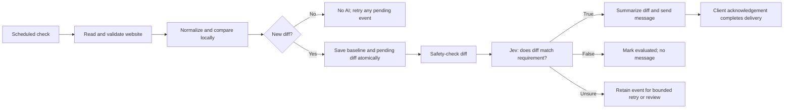

# Website changes that match a requirement

Historical investigation and design proposal, 30 September 2026. The user subsequently
approved implementation: “Sounds good. Implement and test.” Current behavior and
verification are recorded in the linked Plan and the implementation notes below. Source inspected at
`607cd834fa7d1563a05d3ee6e39840a0de144231`.

The user clarified the goal: compare website text between successful checks and
process only the diff through Jev to decide whether the change meets the user's
requirements. RSS and article-list monitoring are outside this proposal.

## Readiness

The system is partially ready. We can reuse the scheduler, website extraction,
Jev AI Check, Ask AI summaries, and encrypted owner-client chat delivery. We need
a persisted successful-read baseline, a deterministic diff, reliable read-quality
signals, a comparison-before-semantic-scan path, and state/delivery integration.

| Capability | Current evidence | Implication |
| --- | --- | --- |
| Scheduled website reads | `workflow_capabilities.yml:1723` marks `web.read` synchronous and unattended; `workflow_scheduler_service.py:112` supports once/hourly/daily/weekly | Reuse existing fetching and scheduling |
| Previous results | `workflow_delivery_history.py:26`, `:103`; Workflow Specification `workflows.history.delivered-membership` | Remembers acknowledged result IDs/URLs; no read-to-read text comparison |
| Existing Check | `workflow_runner.py:438`, `:611`; `WorkflowGraphRenderer.svelte:333` | Conditions compare current-run values; the UI has no persisted previous-read source |
| Jev requirement decision | `workflow_ai_service.py:184` | Already returns true/false/unsure over explicitly selected, bounded, untrusted data |
| Read quality | `read_skill.py:416` | API success becomes a result even if markdown is empty or a challenge page |
| Provider metadata | `read_skill.py:422`, `ReadResult` at `:78` | Current result drops source status, final/source URL, warnings, and structured links |
| Freshness | `read_skill.py:55`; `firecrawl_scrape.py:163`, `:203` | Units disagree in descriptions; provider uses milliseconds and omitted settings allow cached reads |
| Diff-only AI cost | `workflow_app_skill_adapter.py:149`; `app_skill_output_safety.py:196` | Ordinary reads safety-scan full-page text before downstream comparison |
| Input size | `workflow_ai_service.py:506` | Existing AI inputs may truncate at 24,000 characters; monitor must not silently truncate a diff |
| Output picker | `workflow_capabilities.yml:1736`; `workflowBuilder.ts:224` | Web reads have a generic result-array schema; Checks expose only matched. Declare typed diff outputs |
| Delivery/retries | `workflow_action_adapter.py:175`; runtime transaction `delivery_history.js:73`, `:145` | Only owner-client acknowledgement commits delivery membership |
| Text-only event memory | `workflow_action_adapter.py:247`; runtime transaction `delivery_history.js:115` | Current result membership expects result embeds; website change events need explicit text-message acknowledgement support |
| Deletion | Workflow Specification `workflows.history.delete-forgets`; `workflow_service.py:2517` | Run deletion forgets membership; payload expiry differs. Define monitor state lifetime explicitly |

`events.ccc.de` returned HTTP 200 and useful article text during a direct public
read. This establishes source readability today, not a successful OpenMates
Firecrawl/workflow run. The homepage currently has post headings, excerpts and
post links, making it a useful future test fixture. The existing read hash is a
hash of the URL (`base_skill.py:788`), not a content hash. Sending the homepage
through result deduplication would therefore remember that URL rather than its
changing contents.

Firecrawl's current [scrape documentation](https://docs.firecrawl.dev/features/scrape)
confirms the default cache window is two days, `maxAge` uses milliseconds, and
`maxAge: 0` forces a new scrape. A fresh provider request is still not proof that
the returned page has useful/current content. Use an explicit freshness setting
for monitoring and preserve evidence of read quality.

Firecrawl also provides [change tracking](https://docs.firecrawl.dev/features/change-tracking).
Its team/tag-scoped snapshots are persistent and do not expire. Our wrapper does
not expose the returned change tracking data or its structured configuration.
This could be an optional future accelerator, but is not sufficient for our
owner-scoped last-good-read, deletion, retry, and notification semantics.

## Proposed user experience

Keep the visible flow within existing Workflows:

1. **When:** daily, using the existing schedule controls.
2. **Read website:** enter `https://events.ccc.de` in the existing Web read action.
3. **If: AI confirms.** Select **Changes since last successful read** from that
   action and ask “Do these changes announce something new about Chaos
   Communication Congress?”
4. **Then:** summarize those changes and send a message to the selected chat.

For any-change notifications, the exact Check instead selects **Has changed since
last successful read** and tests that boolean. AI relevance is optional. Existing
exact and AI Check modes stay intact; current page text and its changes are
clearly different variable choices. A contextual Website has changed shortcut
can preselect these choices, rather than introducing another top-level skill or
condition type.

This refines the initial combined-Check proposal: reading owns the URL and Check
owns the condition. The executor coordinates comparison internally whenever a
downstream consumer selects a change output. The owner does not configure a
Track changes toggle, storage nodes, hashes, diff algorithms, or cache units.
Keep ordinary standalone Web read available with its existing safety behavior.

The read test shows useful extracted text or a specific blocked/empty/unsupported
state. A change-input test with a baseline shows the diff and requirement verdict. Preview
tests never establish/update the real baseline or create delivery reservations.
A full Run now exercises real monitor state and normal delivery.

Suggested copy: “The first successful check saves a starting point. We'll message
you when later changes match your requirement.” Distinguish “Starting point
saved,” “No change,” “Changed, doesn't match,” “Can't read this website,” “Not
enough information,” and “Update waiting for delivery.”

The default monitors future changes. Existing text is not a new change. If the
requirement can only be answered with extensive unchanged content, the diff-only
evaluation returns Unsure; it does not secretly pass the whole page to Jev.

## Proposed runtime

The full snapshots remain encrypted workflow runtime data. Deterministic
normalization preserves links, dates, prices, numbers, negation and meaningful
ordering; remove only proven layout noise. Produce added/removed text plus a
small amount of conventional diff context. No semantic model processes either
full snapshot on the monitor path. The existing full-page semantic scan must
therefore move after comparison for this trusted internal path only, while
preserving dispatch, billing, rate limits and output safety. No user-visible
disable-protection flag or general raw-page output is introduced.

Jev receives the user's condition, the source URL and changed hunks with their
limited context. No change means no safety-model, relevance-model or summary
call. First-run initialization is deterministic and sends no notification.
Matching diffs can use existing Ask AI for a readable summary; Jev's boolean
output alone does not supply a summary. Summaries also use only safe diff text.
Preserve article links present in added text; when there is no deeper link, cite
the monitored page. Do not invent links or claim to have read full article text.

Read quality must distinguish usable text from network/provider errors, HTTP
errors, challenges, consent/login shells, empty extraction, and partial output.
Do not use a minimum character count as the sole test: short pages can be valid.
Blocked or uncertain reads neither replace the baseline nor become “No change.”
Explicit oversize handling is required because silently losing later diff hunks
could produce a false negative. V1 can surface Unsure/unsupported rather than
introducing unbounded chunk processing.

## State and correctness

Use one compact encrypted state object/reference scoped to the stable Workflow
and Read website node/source configuration, containing the last successful
normalized snapshot, pending diff events, occurrence revision, source generation,
and owning-run metadata. Each consuming Check has its own requirement generation
and pending decision/delivery progress, so two conditions cannot consume or reset
one another's changes.
Extend the existing atomic runtime transaction; do not query the latest historic
run on every check or use Redis-only memory as the durable source of truth.

Save a new baseline and its pending diff event together, under a revision fence.
Otherwise a crash after saving the baseline but before evaluating/sending loses
the change. Advancing the read baseline is distinct from completing a relevance
decision or recording acknowledged delivery. Evaluate pending events even when
the next fetch is unchanged. A newer snapshot must not erase an older event.
Bound the queue visibly; refuse to advance state when a safe bound is exceeded.

False consumes an evaluated event; Unsure preserves it with bounded retry/backoff
and a visible reason. True persists through summary failure, offline clients and
failed/expired/cancelled delivery. Reuse already-computed decisions and summaries
where possible. Only normal encrypted client persistence and acknowledgement
complete delivery. Reservation/queued is not delivery. Delivery fingerprints must
use the change occurrence, not just the website URL. A→B→A creates two changes.

Extend the existing delivery transaction with text-only change-event membership.
Existing result reservations require corresponding permanent result embeds,
which the adapter currently creates for news/events/home results. A diff is not
one of those result types. Its membership should commit with durable summary
message acknowledgement, without inventing a result embed for each event. Keep
existing result/embedding checks intact and test both paths.

Overlapping runs use compare-and-swap state updates. Runs pinned to an older
Workflow version cannot overwrite a new source/requirement generation or deliver
its obsolete pending events. Preserve state across harmless graph edits. Source
or extraction changes visibly initialize a new source generation. Requirement
edits invalidate only that Check's decision generation and apply to future
changes by default; they do not reset another condition's source or queue.

Monitor state and pending diffs need an explicit bounded retention/deletion
contract. Reuse visible owning-run provenance and existing encrypted blob
storage. Deleting/expiring relevant state visibly reinitializes the monitor.
Never silently retain a private snapshot after its owning content is deleted.
Reset baseline and forgotten delivery history must explain possible re-alerting.
This is the remaining material design detail to settle before implementation.

## Implementation and verification

Amend the owning Workflow/UI Specifications with examples for diff-only inference,
initialization, read-quality failure, pending-event recovery, and retention/reset.
Then implement the trusted monitor fetch/comparison path, atomic encrypted state,
typed read change outputs and existing Check inputs, existing Jev/summary/delivery
integration, and the editor.
Extend AI authoring, portable YAML, and affected CLI/SDK contracts together.

Focused unit checks cover normalization/diffs, quality signals, state transitions,
event identities, and actual model-input projection. Product, browser and client
checks run through the isolated GitHub CI coordinator. Real Jev/summary checks
run on dev with disposable state after the scoped implementation is deployed.
Cover offline acknowledgement, concurrent runs, source edits and deletion/reset.

Implementation follows the existing Website read + exact/AI Check composition.
Select **Changes since last successful read** in AI confirms, ask whether the
diff matches the requirement, summarize `{{steps.read.changes}}` with Ask AI,
and send `{{steps.summary.answer}}` to the chosen chat. For any text change,
use **Has changed since last successful read** equals True instead.

State lifetime is resolved: one encrypted latest baseline and up to 100 bounded
pending events per source, separate from run-log payload retention. Explicit
owning-run or Workflow deletion removes comparison state. The next usable read
initializes silently. Run-log payload expiry alone does not reset monitoring.

V1 supports one URL per monitoring read and one website source per consuming
Check. Pages are limited to 1 MB, diffs to 18,000 characters, and model inputs to
the existing 24,000-character bound. Limits fail explicitly without truncating
the diff or advancing the baseline. Jev and summaries receive only diff text
when no current-page output is explicitly selected. Quality detection is a
heuristic based on status, metadata and challenge text; it cannot recognize
every possible shell. RSS, article extraction, full-site crawling and
authenticated sites remain outside this scope.

The focused Python and native transaction suites pass. Editor component CI passed
at https://github.com/glowingkitty/OpenMates/actions/runs/36800809600 (five cases).
Browser persistence and non-sending preview checks passed at
https://github.com/glowingkitty/OpenMates/actions/runs/36802169467. Real
website/Jev/summary dev checks await working test credentials; details are in the Plan. Real inference uses disposable state. Live public
website changes are not under our control, so induced change and offline
acknowledgement paths use controlled runner/native fixtures.

Website-change notifications in v1 contain text and links. Mixing result-list
embeds into that same notification is rejected explicitly; use a separate
workflow for those result deliveries. Comparison blobs also include an encrypted
random nonce so their persisted checksums cannot identify a public page.
