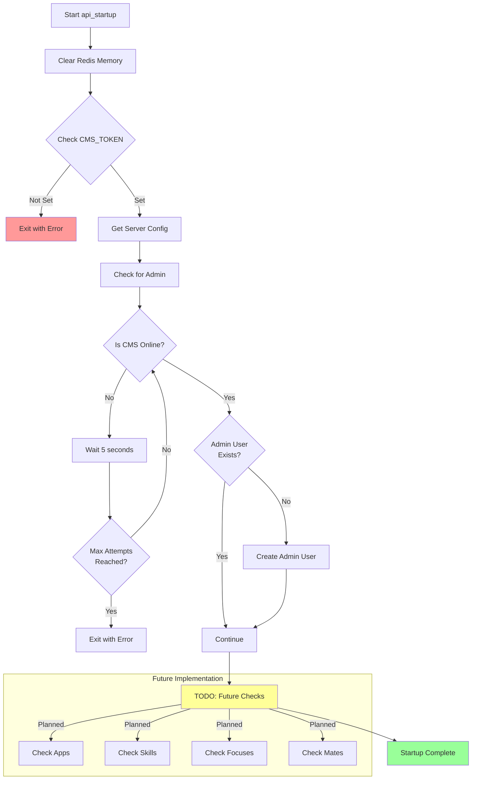

# API Startup Flowchart

```mermaid
flowchart TD
    A[Start api_startup] --> B[Clear Redis Memory]
    B --> C{Check CMS_TOKEN}
    C -->|Not Set| D[Exit with Error]
    C -->|Set| E[Get Server Config]
    E --> F[Check for Admin]
    
    F --> G{Is CMS Online?}
    G -->|No| H[Wait 5 seconds]
    H --> I{Max Attempts<br/>Reached?}
    I -->|Yes| J[Exit with Error]
    I -->|No| G
    
    G -->|Yes| K{Admin User<br/>Exists?}
    K -->|Yes| L[Continue]
    K -->|No| M[Create Admin User]
    M --> L
    
    L --> N[TODO: Future Checks]
    N --> O[Startup Complete]
    
    subgraph "Future Implementation"
        N -->|Planned| P[Check Apps]
        N -->|Planned| Q[Check Skills]
        N -->|Planned| R[Check Focuses]
        N -->|Planned| S[Check Mates]
    end

    style D fill:#ff9999
    style O fill:#99ff99
    style N fill:#ffff99
```
