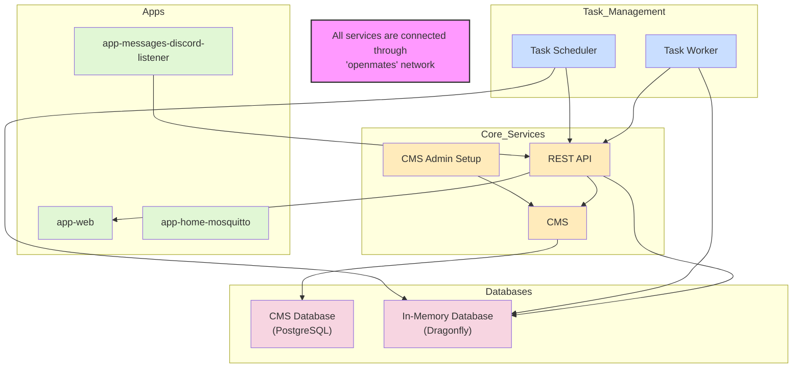

# Docker Compose Flowchart

```mermaid
flowchart TB
    subgraph Apps
        discord["app-messages-discord-listener"]
        web["app-web"]
        mosquitto["app-home-mosquitto"]
    end

    subgraph Core_Services
        rest["REST API"]
        cms["CMS"]
        cms_setup["CMS Admin Setup"]
    end

    subgraph Task_Management
        worker["Task Worker"]
        scheduler["Task Scheduler"]
    end

    subgraph Databases
        cms_db["CMS Database\n(PostgreSQL)"]
        memory_db["In-Memory Database\n(Dragonfly)"]
    end

    %% Dependencies
    discord --> rest
    rest --> cms
    rest --> memory_db
    rest --> web

    cms --> cms_db
    cms_setup --> cms

    worker --> rest
    worker --> memory_db
    scheduler --> rest
    scheduler --> memory_db

    %% Network connections
    classDef network fill:#f9f,stroke:#333,stroke-width:2px
    class network network

    %% All services are connected through 'openmates' network
    note["All services are connected through\n'openmates' network"]
    class note network

    %% Styling
    classDef apps fill:#e1f7d5
    classDef core fill:#ffebbb
    classDef tasks fill:#c9deff
    classDef dbs fill:#f7d5e1

    class discord,web,mosquitto apps
    class rest,cms,cms_setup core
    class worker,scheduler tasks
    class cms_db,memory_db dbs
```
