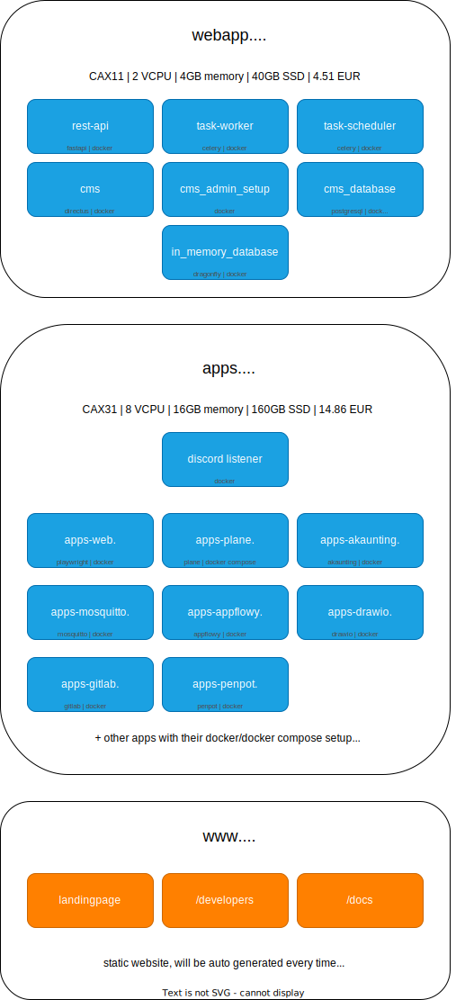
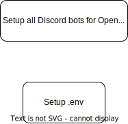

# OpenMates Self Hosted Edition

## Server infrastructure

OpenMates is designed to be deployed on multiple separated servers (for performance & security reasons), but optionally can run on a single device (only recommended for running it locally on your device).

## Server setup

### 1. .env file
Create an .env file based on the env.example. 
CMS secrets will be automatically added later.Make sure to check all other settings/secrets and set them up the way you like.

### 2. ./setup.sh
Start ./setup.sh script and follow the process or execute with input commands for automated setup:

| Option | Description |
|--------|-------------|
| `--setup-core` | Setup a server with all core services. |
| `--setup-apps` | Setup a server with all apps. |
| `--setup-full` | Setup a server with both the core services and the apps setup (Only recommended for running on local device, not recommended for server deployment, for security & performance reasons). |

### Setup overview

------------
OLD:

# Installation guide

## Create bots in messengers

### Discord

- visit [https://discord.com/developers/applications](https://discord.com/developers/applications) and login with your Discord account
- for every AI team mate you want to add to the server, create a new Application
  - /General Information:
    - app icon: see profile_image path in [/server.yml](server.yml)
    - name: '{mate name} (OpenMates)' -> 'Sophia (OpenMates)' for example
    - description: see description in [/server.yml](server.yml)
  - /OAuth2:
    - copy client id and paste it to [/.env](.env) under Apps / Messages / Discord into the client_id field for the AI team mate
    - add redirect url: {YOUR_OPENMATES_HOST}/connect/discord (e.g. https://openmates.ai/connect/discord)
  - /Installation:
    - Installation Contexts: Select 'Guild install'
    - Install Link: Select 'Custom' and enter the oauth url:
      - https://discord.com/oauth2/authorize?client_id={client_id}&scope=bot&permissions=311385246784&response_type=code&redirect_uri={redirect_url, url encoded}
    - Also enter the oauth url in [/.env](.env) under Apps / Messages / Discord into the oauth_url field for the AI team mate
  - /Bot:
    - Token: press 'Reset Token' and copy the new token and paste it to [/.env](.env) under Apps / Messages / Discord into the token field for the AI team mate

## Add all missing secrets to .env, based on env.example

## Start Docker Compose

Once you start the docker compose setup via `docker-compose -f server/docker-compose.yml up --build -d`, OpenMates will start.
The first time you start the server, it will take longer as it needs to install all the dependencies and initialize the database and cms.
Your CMS admin user will also be automatically created.